# Getting Started - Developer Guide

Welcome to the DSA-110 Continuum Imaging Pipeline backend. This guide will help
you understand the codebase and start contributing.

## What This Project Does

The DSA-110 is a radio telescope array that produces **visibility data** (raw
correlator output) in HDF5 format. This pipeline:

1. **Converts** UVH5 files → CASA Measurement Sets (MS)
2. **Calibrates** the data using reference calibrators
3. **Images** the calibrated data to produce FITS images
4. **Catalogs** detected sources with photometry
5. **Serves** results via a REST API and web dashboard

```text
UVH5 files → Conversion → MS files → Calibration → Imaging → FITS → Catalog
     ↓                                                              ↓
  /data/incoming                                              /stage/products
```

## Environment Setup

**Required**: The `casa6` conda environment with CASA 6.7, pyuvdata, and dependencies.

```bash
# Activate the environment (required for ALL operations)
conda activate casa6

# Verify
python -c "import casatools; print('CASA OK')"
python -c "import pyuvdata; print('pyuvdata OK')"
```

See `ops/docker/environment.yml` for the full dependency list.

## Architecture Overview



_Visual diagram of module dependencies and data flow._

## Project Layout

```text
backend/
├── src/dsa110_contimg/     # Main Python package
│   ├── api/                # REST API (FastAPI)
│   ├── conversion/         # UVH5 → MS conversion
│   ├── calibration/        # Calibration routines
│   ├── imaging/            # WSClean/CASA imaging wrappers
│   ├── pipeline/           # Stage-based processing
│   ├── database/           # SQLite helpers
│   ├── catalog/            # Source catalogs (NVSS, FIRST)
│   ├── photometry/         # Source extraction & measurement
│   ├── simulation/         # Synthetic test data generation
│   ├── docsearch/          # Documentation search
│   └── utils/              # Shared utilities
├── tests/                  # Unit and integration tests
├── scripts/                # Utility scripts
└── docs/                   # Documentation
```

## Key Entry Points

### 1. API Server (`api/`)

Start here if you're working on the web interface or REST endpoints.

```bash
# Run the API
python -m uvicorn dsa110_contimg.api.app:app --reload --port 8000

# View interactive docs
open http://localhost:8000/api/docs
```

**Key files:**

- `api/app.py` - FastAPI application factory
- `api/routes/` - Endpoint handlers (images, sources, jobs, etc.)
- `api/repositories.py` - Data access layer
- `api/schemas.py` - Request/response models

### 2. Conversion Pipeline (`conversion/`)

Start here if you're working on data ingestion.

```bash
# Convert a time range of observations
python -m dsa110_contimg.conversion.cli groups \
    /data/incoming /stage/dsa110-contimg/ms \
    "2025-01-01T00:00:00" "2025-01-01T01:00:00"
```

**Key files:**

- `conversion/hdf5_orchestrator.py` - Batch conversion logic
- `conversion/writers.py` - MS writing strategies
- `conversion/cli.py` - Command-line interface for batch conversion
- `conversion/streaming/normalize.py` - Filename normalization for ABSURD ingestion

### 3. Pipeline Stages (`pipeline/`)

Start here if you're working on the processing workflow.

**Key files:**

- `pipeline/stages.py` - Stage definitions
- `pipeline/stages_impl.py` - Stage implementations
- `pipeline/coordinator.py` - Pipeline orchestration

### 4. Calibration (`calibration/`)

Start here if you're working on data calibration.

**Key files:**

- `calibration/calibration.py` - Core calibration routines (gaincal)
- `calibration/selection.py` - Bandpass field selection with PB-weighted flux
- `calibration/field_naming.py` - Calibrator field detection and renaming
- `calibration/catalog_registry.py` - Unified catalog query interface

## Running Tests

```bash
cd /data/dsa110-contimg/backend
conda activate casa6

# View available test commands
make help

# Fast unit tests (~40s, 1077 tests)
make test-fast

# All unit tests (~55s, 1186 tests)
make test-unit

# Contract tests (~45s, 163 tests)
make test-contract

# Parallel execution (faster on multi-core)
make test-parallel

# Full test suite
make test
```

### Direct pytest commands

```bash
# Run with verbose output
python -m pytest tests/unit/ -v --tb=short

# Run specific test file
python -m pytest tests/unit/test_events.py -v

# Run with coverage
python -m pytest tests/unit/ --cov=dsa110_contimg --cov-report=term-missing

# Integration tests (requires CASA and real data)
python -m pytest tests/integration/ -v
```

### Test Organization

| Directory            | Purpose                       | Typical Runtime |
| -------------------- | ----------------------------- | --------------- |
| `tests/unit/`        | Fast isolated tests           | ~55s            |
| `tests/contract/`    | Tests with real data fixtures | ~45s            |
| `tests/integration/` | Full pipeline tests           | Minutes         |

### Test Coverage

Current test suite: **1,400+ tests** across unit, contract, and integration tests.

| Module                | Coverage | Target |
| --------------------- | -------- | ------ |
| `batch/qa.py`         | 97%      | 80%    |
| `batch/thumbnails.py` | 97%      | 80%    |
| `websocket.py`        | 84%      | 70%    |
| `cache.py`            | 89%      | 60%    |
| `metrics.py`          | 93%      | 60%    |

Key testing patterns used:

- **CASA mocking**: Use `patch.dict('sys.modules', {'casatools': MagicMock()})`
- **WebSocket testing**: Use `TestClient` with `websocket_connect()`
- **Metrics isolation**: Create fresh `CollectorRegistry()` per test

## Common Development Tasks

### Adding a New API Endpoint

1. Define the Pydantic schema in `api/schemas.py`
2. Add the route handler in `api/routes/{resource}.py`
3. Add repository method in `api/repositories.py` if needed
4. Write tests in `tests/unit/api/`

### Adding a New Pipeline Stage

1. Define the stage in `pipeline/stages.py`
2. Implement in `pipeline/stages_impl.py`
3. Register in the coordinator

### Modifying Conversion Logic

1. Make changes in `conversion/` module
2. Test with synthetic data:

   ```bash
   python -m dsa110_contimg.simulation.generate_uvh5 --output-dir /tmp/test
   ```

3. Run conversion on test data

## Database Configuration

The backend uses SQLite for all data storage. Database path is configured via
environment variable:

```bash
# Default path
export DSA110_DB_SQLITE_PATH="/data/dsa110-contimg/state/db/products.sqlite3"
```

See `docs/database-adapters.md` for the database adapter API.

> **Note:** The ABSURD workflow manager uses its own separate PostgreSQL
> database for job orchestration. See `docs/ops/absurd-service-activation.md`.

## Debugging Tips

### Check logs

```bash
tail -f /data/dsa110-contimg/state/logs/conversion.log
```

### Run with verbose output

```bash
python -m dsa110_contimg.conversion.cli groups --dry-run ...
```

### Interactive exploration

```python
from dsa110_contimg.utils import FastMeta

with FastMeta("/path/to/file.hdf5") as meta:
    print(meta.time_array)
    print(meta.freq_array)
```

## Next Steps

1. **Read the architecture docs**: `docs/ARCHITECTURE.md`
2. **Explore the API**: Run the server and browse `/api/docs`
3. **Run the tests**: Get familiar with the test patterns
4. **Pick an issue**: Check `TODO.md` or GitHub issues

## Getting Help

- **Documentation search**: `python -m dsa110_contimg.docsearch.cli search "topic"`
- **Project docs**: `/data/dsa110-contimg/docs/`
- **Module docstrings**: Most functions have detailed docstrings
