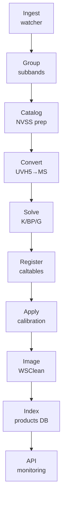

# DSA-110 Architecture Guide

**System architecture and design patterns for the DSA-110 Continuum Imaging Pipeline.**

!!! note "Version"
Last updated: December 5, 2025

---

## System Overview

The DSA-110 Continuum Imaging Pipeline is a **unified task-based system** for processing radio astronomy data from the DSA-110 telescope.

### High-Level Flow

```
┌─────────────────────────────────────────────────────────────────┐
│                        Data Sources                              │
│  /data/incoming/  ← Raw UVH5 subband files from correlator      │
└─────────────────────────────────────────┬───────────────────────┘
                                          │
                                          ▼
┌─────────────────────────────────────────────────────────────────┐
│                    ABSURD Ingestion                              │
│  - Scheduled polling (every minute)                             │
│  - Groups 16 subbands by timestamp                              │
│  - Normalizes to sb00's timestamp                               │
│  - Converts UVH5 → Measurement Set (MS)                         │
└─────────────────────────────────────────┬───────────────────────┘
                                          │
                                          ▼
┌─────────────────────────────────────────────────────────────────┐
│                    Processing Pipeline                           │
│  Calibration → Imaging → Photometry → Catalog                   │
└─────────────────────────────────────────┬───────────────────────┘
                                          │
                                          ▼
┌─────────────────────────────────────────────────────────────────┐
│                    Output Products                               │
│  /stage/dsa110-contimg/ ← MS files, FITS images, catalogs       │
└─────────────────────────────────────────────────────────────────┘
```

### Key Characteristics

- **Input**: Raw visibility data (UVH5 format) in `/data/incoming/`
- **Processing**: Stage-based Python pipeline (`dsa110_contimg`)
- **Orchestration**: ABSURD task queue (PostgreSQL-backed durable workflow manager)
- **Output**: Calibrated Measurement Sets and Images in `/stage/dsa110-contimg/`
- **Interface**: React/Vite dashboard for monitoring and control

---

## Backend Architecture

### Layered Design

```
┌─────────────────────────────────────────────────────────────────┐
│                    FastAPI Routes Layer                          │
│   (routes/*.py - HTTP handlers, request/response mapping)       │
└─────────────────────────────────────────────────────────────────┘
                              │
                              ▼
┌─────────────────────────────────────────────────────────────────┐
│                    Services Layer                                │
│   (services/*.py - Business logic, orchestration)               │
└─────────────────────────────────────────────────────────────────┘
                              │
                              ▼
┌─────────────────────────────────────────────────────────────────┐
│                  Repositories Layer                              │
│   (async_repositories.py - Data access, aiosqlite)              │
└─────────────────────────────────────────────────────────────────┘
                              │
                              ▼
┌─────────────────────────────────────────────────────────────────┐
│               Database Abstraction Layer                         │
│   (db_adapters/ - SQLite adapters)                              │
└─────────────────────────────────────────────────────────────────┘
```

### Package Structure

```
backend/src/dsa110_contimg/
├── api/                # REST API (FastAPI) - Fully Async
│   ├── app.py          # Application factory
│   ├── routes/         # API endpoint handlers
│   ├── services/       # Business logic
│   ├── schemas.py      # Pydantic models
│   └── db_adapters/    # Database abstraction
│
├── conversion/         # UVH5 → MS Conversion
│   ├── hdf5_orchestrator.py    # Batch orchestration
│   ├── direct_subband.py       # MS writer
│   └── writers.py              # Writer factory
│
├── absurd/             # ABSURD Task Queue
│   ├── client.py       # PostgreSQL client
│   ├── worker.py       # Task worker
│   ├── ingestion.py    # Ingestion tasks
│   └── scheduling.py   # Cron-like scheduler
│
├── calibration/        # CASA Calibration
│   ├── calibration.py  # Core calibration
│   ├── applycal.py     # Apply solutions
│   └── caltables.py    # Table management
│
├── imaging/            # Imaging (WSClean, tclean)
│   ├── fast_imaging.py # Fast algorithms
│   └── cli.py          # CLI interface
│
├── database/           # Data Persistence
│   ├── unified.py      # Unified DB access
│   └── registry.py     # Product registry
│
├── catalog/            # Source Catalogs
├── photometry/         # Source Detection
├── pipeline/           # Pipeline Orchestration
└── utils/              # Shared Utilities
```

### Key Design Patterns

#### Protocol-Based Interfaces

Repository interfaces use Python `Protocol` for type-safe abstractions:

```python
from typing import Protocol

class ImageRepositoryProtocol(Protocol):
    async def get_by_id(self, image_id: str) -> Optional[ImageRecord]: ...
    async def list_all(self, limit: int, offset: int) -> List[ImageRecord]: ...
```

#### Dependency Injection

FastAPI's `Depends()` for clean dependency management:

```python
@router.get("/{image_id}")
async def get_image(
    image_id: str,
    service: AsyncImageService = Depends(get_async_image_service),
):
    return await service.get_image(image_id)
```

#### Async Architecture

The API is fully async using:

- **aiosqlite**: Non-blocking SQLite access
- **httpx**: Async HTTP client
- **asyncio**: TCP/Redis health checks

---

## Pipeline Data Flow

### Complete Processing Chain

```
UVH5 Files → conversion/ → Measurement Sets → calibration/ → Calibrated MS
                                                    ↓
                                              imaging/ → FITS Images
                                                    ↓
                                          photometry/ → Source Catalog
```

### Stage Details



### Processing Stages

| Stage         | Module                              | Description              |
| ------------- | ----------------------------------- | ------------------------ |
| **Scan**      | `absurd/ingestion.py`               | Poll for new UVH5 files  |
| **Record**    | `absurd/ingestion.py`               | Track subband arrivals   |
| **Normalize** | `conversion/streaming/normalize.py` | Rename to sb00 timestamp |
| **Convert**   | `conversion/hdf5_orchestrator.py`   | UVH5 → Measurement Set   |
| **Calibrate** | `calibration/calibration.py`        | Solve K/BP/G solutions   |
| **Apply**     | `calibration/applycal.py`           | Apply calibration tables |
| **Image**     | `imaging/fast_imaging.py`           | WSClean/tclean imaging   |
| **Index**     | `database/registry.py`              | Register products        |

---

## Database Architecture

### Unified Pipeline Database

All pipeline state in `state/db/pipeline.sqlite3`:

```
┌─────────────────────────────────────────────────────────────────┐
│                    pipeline.sqlite3                              │
├─────────────────────────────────────────────────────────────────┤
│  ms_index           │ Measurement Set registry                  │
│  images             │ Image products                            │
│  caltables          │ Calibration table registry                │
│  hdf5_files         │ UVH5 file tracking                        │
│  calibrator_transits│ Pre-calculated transit times              │
│  jobs               │ Job execution history                     │
│  photometry         │ Source flux measurements                  │
│  mosaics            │ Mosaic image products                     │
└─────────────────────────────────────────────────────────────────┘
```

### Key Tables

| Table                 | Purpose                                      |
| --------------------- | -------------------------------------------- |
| `ms_index`            | Tracks MS lifecycle (path, status, stage)    |
| `images`              | Registry of FITS images (path, type, noise)  |
| `hdf5_files`          | UVH5 subband file index (group_id, coords)   |
| `caltables`           | Calibration tables and validity windows      |
| `calibrator_transits` | Pre-calculated transit times for calibrators |

### Concurrency Strategy

- **WAL Mode**: Write-Ahead Logging for non-blocking reads
- **Timeouts**: 30s busy timeout for lock contention
- **Connection Pooling**: Managed by aiosqlite

### External Catalogs

Read-only reference data in `state/catalogs/`:

| Catalog                   | Description                      |
| ------------------------- | -------------------------------- |
| `master_sources.sqlite3`  | 1.6M+ sources (NVSS/FIRST/VLASS) |
| `vla_calibrators.sqlite3` | VLA calibrator catalog           |
| `nvss_dec+XX.X.sqlite3`   | NVSS by declination strip        |

---

## Frontend Architecture

### Technology Stack

```
┌─────────────────────────────────────────────────────────────────┐
│                    Browser (React Frontend)                      │
│  ┌──────────────────────────────────────────────────────────┐   │
│  │  React 18 + TypeScript + Material-UI v6                  │   │
│  │  ├── Pages (8 routes)                                    │   │
│  │  ├── Components (50+ reusable)                          │   │
│  │  ├── API Client (Axios + React Query)                    │   │
│  │  └── State Management (React Query + WebSocket)         │   │
│  └──────────────────────────────────────────────────────────┘   │
└─────────────────────────────────────────────────────────────────┘
```

### Core Technologies

| Technology           | Purpose           |
| -------------------- | ----------------- |
| React 18             | UI framework      |
| TypeScript           | Type safety       |
| Material-UI v6       | Component library |
| TanStack React Query | Server state      |
| React Router v6      | Client routing    |
| Vite 7               | Build tool        |

### State Management

- **React Query**: Server state, caching, background refresh
- **WebSocket**: Real-time updates with polling fallback
- **Zustand**: Client-side state (minimal)

### Data Visualization

| Library   | Purpose               |
| --------- | --------------------- |
| Plotly.js | Scientific plotting   |
| D3.js     | Custom visualizations |
| AG Grid   | Data tables           |
| JS9       | FITS viewing          |
| CARTA     | Advanced image viewer |

---

## Conversion Architecture

### Subband Grouping

DSA-110 produces **16 subband files per observation** (`sb00`-`sb15`):

```
2025-10-05T12:30:00_sb00.hdf5
2025-10-05T12:30:00_sb01.hdf5
...
2025-10-05T12:30:00_sb15.hdf5
```

**Critical**: Subbands may have slightly different timestamps (up to ±60s) due to correlator write timing jitter.

#### Two Grouping Mechanisms

The pipeline uses **two complementary mechanisms** to handle timestamp jitter:

| Mechanism          | Used By          | How It Works                                       |
| ------------------ | ---------------- | -------------------------------------------------- |
| **Normalization**  | ABSURD ingestion | Renames files to canonical timestamp (sb00's time) |
| **Time-Windowing** | Batch processing | Clusters files within 60s tolerance at query time  |

**Normalization (ABSURD ingestion)**: When files are ingested via ABSURD, they are renamed so all 16 subbands share sb00's timestamp as the canonical `group_id`. This ensures clean grouping for ongoing ingestion into `pipeline.sqlite3`:

```python
from dsa110_contimg.conversion.streaming.normalize import normalize_directory

stats = normalize_directory(Path("/data/incoming"), dry_run=True)
```

**Time-Windowing (Batch processing)**: For historical data or batch queries against `hdf5_file_index.sqlite3`, use clustering:

```python
from dsa110_contimg.database.hdf5_index import query_subband_groups
groups = query_subband_groups(db_path, start, end, cluster_tolerance_s=60.0)
```

This clusters files where timestamps are within 60 seconds of each other into the same observation group.

````

### Writer Selection

```mermaid
flowchart LR
  Auto["auto"] --> N{"≤2 subbands?"}
  N -->|yes| Mono["pyuvdata<br/>(TEST ONLY)"]
  N -->|no| Par["parallel-subband<br/>(PRODUCTION)"]
  Par --> MS["Final MS"]
  Mono --> MS
````

- **Production**: Always use `parallel-subband` writer (16 subbands)
- **Testing**: `pyuvdata` writer for ≤2 subbands only
- `direct-subband` is an alias for `parallel-subband`

### Staging Strategy

- **tmpfs** (`/dev/shm/`): Fastest, in-memory staging
- **SSD** (`/scratch/`): Fast NVMe scratch space
- **HDD** (`/data/`): Persistent but slow (avoid for I/O-intensive ops)

---

## ABSURD Task Queue

ABSURD (Asynchronous Background Service for Unified Resource Distribution) handles durable task execution.

### Architecture

```
┌──────────────────┐     ┌────────────────────────┐     ┌──────────────────┐
│   API / Client   │────▶│   SQLite (tasks table) │◀────│  AbsurdWorker    │
│  spawn_task()    │     │   - SKIP LOCKED        │     │  claim_task()    │
└──────────────────┘     └────────────────────────┘     │  execute()       │
                                                        └──────────────────┘
```

### Key Features

- **Durable persistence**: Tasks survive crashes
- **Atomic claims**: Exactly-once execution
- **DAG dependencies**: Parent-child task relationships
- **Dead letter queue**: Failed tasks after retries
- **Cron scheduling**: Time-based triggers

### Usage

```python
from dsa110_contimg.absurd import AbsurdClient

async def main():
    client = AbsurdClient.from_env()
    await client.connect()

    # Spawn a task
    task_id = await client.spawn("convert_uvh5", {"ms_path": "/path/to.ms"})

    # Check status
    stats = await client.get_queue_stats("dsa110-pipeline")
    await client.close()
```

---

## Service Communication

### API Endpoints

The backend exposes 100+ REST endpoints:

| Route Prefix       | Purpose          |
| ------------------ | ---------------- |
| `/api/v1/images`   | Image products   |
| `/api/v1/sources`  | Source catalog   |
| `/api/v1/jobs`     | Job management   |
| `/api/v1/ms`       | Measurement Sets |
| `/api/v1/cal`      | Calibration      |
| `/api/v1/queue`    | Processing queue |
| `/api/v1/services` | Service health   |

### WebSocket Events

Real-time updates via WebSocket:

| Event          | Description        |
| -------------- | ------------------ |
| `task_update`  | Task status change |
| `queue_update` | Queue state change |
| `job_complete` | Job finished       |

### Health Checks

```bash
# API health
curl http://localhost:8000/api/status

# Service health
curl http://localhost:8000/api/v1/services/health
```

---

## Storage Architecture

### Mount Points

| Mount             | Type     | Purpose                       |
| ----------------- | -------- | ----------------------------- |
| `/data/`          | HDD      | Source code, databases (slow) |
| `/data/incoming/` | HDD      | Raw UVH5 files                |
| `/stage/`         | NVMe SSD | Output products (fast)        |
| `/scratch/`       | NVMe SSD | Temporary files, builds       |
| `/dev/shm/`       | tmpfs    | In-memory staging             |

### Data Flow

```
/data/incoming/      ← Raw UVH5 from correlator
        │
        ▼
/dev/shm/ or /scratch/  ← Temporary staging
        │
        ▼
/stage/dsa110-contimg/  ← Output MS files, images
        │
        ▼
/data/.../state/db/    ← SQLite databases
```

---

## Critical Constraints

### Must Follow

1. **Storage Separation**: Use `/stage/` and `/scratch/` for I/O-intensive operations, not `/data/`
2. **No ORM**: Use raw SQL with helper functions (no SQLAlchemy/Django ORM)
3. **Async Core**: Avoid blocking calls in ABSURD worker loop
4. **casa6 Environment**: Always use casa6 conda environment

### Performance Considerations

- **WAL mode** for concurrent SQLite access
- **Connection pooling** for database connections
- **tmpfs staging** for fast file operations
- **Parallel processing** where possible

---

## Module Reference

### Quick Lookup

| Task               | File/Module               |
| ------------------ | ------------------------- |
| Modify DB schema   | `database/unified.py`     |
| Add pipeline stage | `pipeline/stages_impl.py` |
| Debug WSClean      | `imaging/fast_imaging.py` |
| Check health logic | `pipeline/health.py`      |
| Add API route      | `api/routes/*.py`         |
| Frontend routes    | `frontend/src/App.tsx`    |

### Entry Points

```bash
# API Server
uvicorn dsa110_contimg.api.app:app --port 8000

# Batch Conversion
python -m dsa110_contimg.conversion.cli groups ...

# ABSURD Worker (ingestion with normalization)
python -m dsa110_contimg.absurd.worker

# Imaging
python -m dsa110_contimg.imaging.cli ...
```

---

## Related Documentation

- **[Quick Start](QUICKSTART.md)**: Get running in 5 minutes
- **[Storage & Files](guides/storage-and-file-organization.md)**: File organization and database paths
- **[Dashboard Guide](guides/dashboard.md)**: Web interface operations
- **[Developer Guide](DEVELOPER_GUIDE.md)**: Contributing guidelines
- **[API Reference](API_REFERENCE.md)**: REST API documentation
- **[Troubleshooting](TROUBLESHOOTING.md)**: Problem resolution
