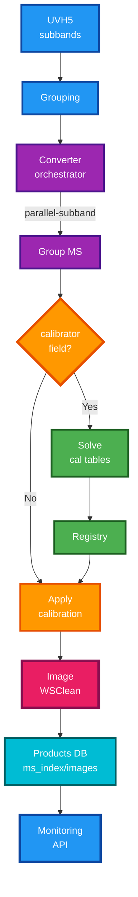

# Concepts: Architecture

```mermaid
flowchart TB
  A["UVH5<br/>subbands"] --> B["Grouping"]
  B --> C["Converter<br/>orchestrator"]
  C -->|parallel-subband| D["Group MS"]
  D --> E{"calibrator<br/>field?"}
  E -->|Yes| F["Solve<br/>cal tables"]
  F --> G["Registry"]
  E -->|No| H["Apply<br/>calibration"]
  G --> H
  H --> I["Image<br/>WSClean"]
  I --> J["Products DB<br/>ms_index/images"]
  J --> K["Monitoring<br/>API"]

  %% Input stages - vibrant blue
  style A fill:#2196F3,stroke:#0D47A1,stroke-width:3px,color:#FFF
  style B fill:#2196F3,stroke:#0D47A1,stroke-width:3px,color:#FFF

  %% Conversion - vibrant purple
  style C fill:#9C27B0,stroke:#4A148C,stroke-width:3px,color:#FFF
  style D fill:#9C27B0,stroke:#4A148C,stroke-width:3px,color:#FFF

  %% Decision point - bright orange, prominent
  style E fill:#FF9800,stroke:#E65100,stroke-width:4px,color:#FFF

  %% Calibration path - vibrant green
  style F fill:#4CAF50,stroke:#1B5E20,stroke-width:3px,color:#FFF
  style G fill:#4CAF50,stroke:#1B5E20,stroke-width:3px,color:#FFF

  %% Apply calibration - orange
  style H fill:#FF9800,stroke:#E65100,stroke-width:3px,color:#FFF

  %% Imaging - vibrant pink
  style I fill:#E91E63,stroke:#880E4F,stroke-width:4px,color:#FFF

  %% Database - teal/cyan
  style J fill:#00BCD4,stroke:#006064,stroke-width:3px,color:#FFF

  %% API - vibrant blue
  style K fill:#2196F3,stroke:#0D47A1,stroke-width:4px,color:#FFF
```
