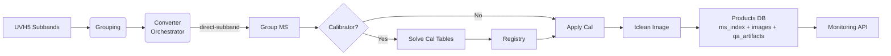

# Concepts: Architecture

```mermaid
flowchart LR
  A[UVH5 Subbands] --> B(Grouping)
  B --> C(Converter<br/>Orchestrator)
  C -->|direct-subband| D[Group MS]
  D --> E{Calibrator?}
  E -->|Yes| F[Solve Cal Tables]
  F --> G[Registry]
  E -->|No| H[Apply Cal]
  G --> H
  H --> I[tclean Image]
  I --> J[Products DB<br/>ms_index + images + qa_artifacts]
  J --> K[Monitoring API]
```
