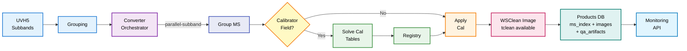

# Concepts: Architecture

```mermaid
flowchart LR
  A["UVH5<br/>Subbands"] --> B["Grouping"]
  B --> C["Converter<br/>Orchestrator"]
  C -->|parallel-subband| D["Group MS"]
  D --> E{"Calibrator<br/>Field?"}
  E -->|Yes| F["Solve Cal<br/>Tables"]
  F --> G["Registry"]
  E -->|No| H["Apply<br/>Cal"]
  G --> H
  H --> I["WSClean Image<br/>tclean available"]
  I --> J["Products DB<br/>ms_index + images<br/>+ qa_artifacts"]
  J --> K["Monitoring<br/>API"]
  
  style A fill:#E3F2FD,stroke:#1976D2,stroke-width:2px,color:#000
  style B fill:#E3F2FD,stroke:#1976D2,stroke-width:2px,color:#000
  style C fill:#F3E5F5,stroke:#7B1FA2,stroke-width:2px,color:#000
  style D fill:#E8EAF6,stroke:#3F51B5,stroke-width:2px,color:#000
  style E fill:#FFF9C4,stroke:#F57F17,stroke-width:2px,color:#000
  style F fill:#E8F5E9,stroke:#388E3C,stroke-width:2px,color:#000
  style G fill:#E8F5E9,stroke:#388E3C,stroke-width:2px,color:#000
  style H fill:#FFF3E0,stroke:#F57C00,stroke-width:2px,color:#000
  style I fill:#FCE4EC,stroke:#C2185B,stroke-width:2px,color:#000
  style J fill:#E0F2F1,stroke:#00796B,stroke-width:2px,color:#000
  style K fill:#E1F5FE,stroke:#0277BD,stroke-width:2px,color:#000
```
