# DSA-110 Continuum Imaging Pipeline: Complete Workflow Visualization

**Purpose:** Comprehensive, instructive visualization of the pipeline workflow
from raw UVH5 data ingestion to final calibrated continuum images.

**Last Updated:** 2025-11-12

---

## Table of Contents

1. [End-to-End Pipeline Overview](#end-to-end-pipeline-overview)
2. [Detailed Stage Breakdown](#detailed-stage-breakdown)
3. [State Machine & Queue Management](#state-machine--queue-management)
4. [Data Products & Artifacts](#data-products--artifacts)
5. [Database Interactions](#database-interactions)
6. [Performance Optimization Paths](#performance-optimization-paths)

---

## End-to-End Pipeline Overview

### Complete Data Flow

```mermaid
flowchart TB
 subgraph INGEST["Stage 1: Ingest & Grouping"]
 Files["UVH5 files<br/>16 subbands"]
 Watch["Directory<br/>watcher"]
 Queue["Queue DB<br/>ingest.sqlite3"]
 Files --> Watch
 Watch --> Queue
 end

 subgraph CATALOG["Stage 2: Catalog Setup"]
 CatalogPrep["NVSS catalog<br/>preparation"]
 CatalogPrep --> Queue
 end

 subgraph CONVERT["Stage 3: Conversion"]
 Group["Group<br/>5-min windows"]
 Orch["Orchestrator<br/>hdf5_orchestrator"]
 Writer{"Writer<br/>selection"}
 Par["parallel-subband<br/>PRODUCTION"]
 Mono["pyuvdata<br/>TESTING"]
 Stage["Staging<br/>tmpfs/SSD"]
 Concat["concat<br/>full-band MS"]
 Config["Configure MS<br/>MODEL_DATA/CORRECTED_DATA"]
 Validate["Validate<br/>readable"]
 MS["Measurement Set<br/>ready"]
 Queue --> Group
 Group --> Orch
 Orch --> Writer
 Writer -->|>2 subbands| Par
 Writer -->|<=2 subbands| Mono
 Par --> Stage
 Stage --> Concat
 Mono --> Config
 Concat --> Config
 Config --> Validate
 Validate --> MS
 end

 subgraph CAL["Stage 4: Calibration"]
 CalSolve["Solve<br/>K/BP/G"]
 Reg["Register<br/>caltables"]
 CalApply["Apply<br/>calibration"]
 Verify["Verify<br/>non-zero"]
 MS --> CalSolve
 CalSolve --> Reg
 Reg --> CalApply
 CalApply --> Verify
 end

 subgraph IMAGE["Stage 5: Imaging"]
 Clean["WSClean<br/>imaging"]
 Quick{"Quick<br/>mode?"}
 Full["Full<br/>quality"]
 QuickImg["Quick look<br/>imsize≤512"]
 Fits{"Export<br/>FITS?"}
 FITS["FITS<br/>export"]
 Verify --> Clean
 Clean --> Quick
 Quick -->|Yes| QuickImg
 Quick -->|No| Full
 QuickImg --> Fits
 Full --> Fits
 Fits -->|Yes| FITS
 Fits -->|No| ImgFiles["CASA<br/>images"]
 end

 subgraph VALIDATE["Stage 6: Validation (Optional)"]
 ValidateStage["QA<br/>validation"]
 FITS --> ValidateStage
 ImgFiles --> ValidateStage
 end

 subgraph CROSSMATCH["Stage 7: Cross-Match (Optional)"]
 CrossMatchStage["Cross-Match<br/>NVSS"]
 ValidateStage --> CrossMatchStage
 ImgFiles --> CrossMatchStage
 end

 subgraph PHOTOMETRY["Stage 8: Photometry (Optional)"]
 PhotometryStage["Photometry<br/>adaptive"]
 CrossMatchStage --> PhotometryStage
 ImgFiles --> PhotometryStage
 end

 subgraph PRODUCT["Stage 9: Products & Indexing"]
 Products["Products DB<br/>products.sqlite3"]
 MSIdx["MS Index<br/>ms_index"]
 ImgIdx["Image Index<br/>images"]
 QA["QA<br/>artifacts"]
 Products --> MSIdx
 Products --> ImgIdx
 Products --> QA
 FITS --> Products
 ImgFiles --> Products
 ValidateStage --> Products
 CrossMatchStage --> Products
 PhotometryStage --> Products
 end

 subgraph API["Stage 10: Monitoring & Access"]
 FastAPI["FastAPI<br/>server"]
 Status["Status<br/>endpoints"]
 QAView["QA<br/>views"]
 Products --> FastAPI
 FastAPI --> Status
 FastAPI --> QAView
 end

 %% Subgraph styling - vibrant colors with backgrounds
 style INGEST fill:#E3F2FD,stroke:#1976D2,stroke-width:3px,color:#000
 style CATALOG fill:#E8F5E9,stroke:#388E3C,stroke-width:3px,color:#000
 style CONVERT fill:#F3E5F5,stroke:#7B1FA2,stroke-width:3px,color:#000
 style CAL fill:#E8F5E9,stroke:#388E3C,stroke-width:3px,color:#000
 style IMAGE fill:#FCE4EC,stroke:#C2185B,stroke-width:3px,color:#000
 style VALIDATE fill:#F5F5F5,stroke:#757575,stroke-width:2px,stroke-dasharray: 5 5,color:#000
 style CROSSMATCH fill:#F5F5F5,stroke:#757575,stroke-width:2px,stroke-dasharray: 5 5,color:#000
 style PHOTOMETRY fill:#F5F5F5,stroke:#757575,stroke-width:2px,stroke-dasharray: 5 5,color:#000
 style PRODUCT fill:#E0F2F1,stroke:#00796B,stroke-width:3px,color:#000
 style API fill:#E1F5FE,stroke:#0277BD,stroke-width:3px,color:#000

 %% Node styling - vibrant colors for key nodes
 style Writer fill:#FF9800,stroke:#E65100,stroke-width:3px,color:#FFF
 style Quick fill:#FF9800,stroke:#E65100,stroke-width:3px,color:#FFF
 style Fits fill:#FF9800,stroke:#E65100,stroke-width:3px,color:#FFF
 style Par fill:#4CAF50,stroke:#1B5E20,stroke-width:3px,color:#FFF
 style Mono fill:#F44336,stroke:#B71C1C,stroke-width:3px,color:#FFF
 style MS fill:#4CAF50,stroke:#1B5E20,stroke-width:3px,color:#FFF
 style Clean fill:#E91E63,stroke:#880E4F,stroke-width:3px,color:#FFF
```

**Key Points:**

- **Stage 1**: Continuous monitoring of incoming UVH5 files, grouping by
  timestamp
- **Stage 2**: Catalog setup prepares NVSS catalog for calibration (runs before
  conversion)
- **Stage 3**: Conversion includes MS configuration (MODEL_DATA, CORRECTED_DATA,
  WEIGHT_SPECTRUM) - MS is ready for calibration after conversion
- **Stage 4**: Calibration split into two sub-stages: `calibrate_solve` (solves
  K/BP/G) and `calibrate_apply` (applies solutions to create CORRECTED_DATA
  column)
- **Stage 5**: Imaging with optional development tier for speed (⚠️ NON-SCIENCE)
- **Stage 6**: Validation (optional) - QA validation with tiered validation for
  fast execution
- **Stage 7**: Cross-match (optional) - Source cross-matching with NVSS catalog
- **Stage 8**: Adaptive photometry (optional) - Differential flux measurement
- **Stage 9**: All products indexed in SQLite database
- **Stage 10**: API provides monitoring and access to all products

---

## Detailed Stage Breakdown

### Stage 1: Ingest and Grouping

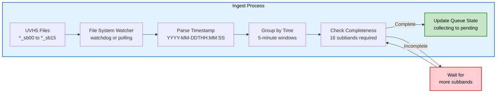

**Details:**

- **Input**: `*_sb??.hdf5` files in `/data/incoming/`
- **Pattern**: `YYYY-MM-DDTHH:MM:SS_sb??.hdf5`
- **Grouping**: 5-minute time windows (configurable via `--chunk-duration`)
- **Completeness**: All 16 subbands must arrive before processing
- **Database**: `state/ingest.sqlite3` tracks `subband_files` and `ingest_queue`

---

### Stage 2: Conversion (UVH5 to MS)

```mermaid
flowchart TB
 subgraph CONVERT_DETAIL["Conversion Process"]
 Start["Group Acquired<br/>pending to in_progress"]
 Orch["Orchestrator CLI<br/>hdf5_orchestrator.py"]
 WriterSel{"Writer<br/>Selection"}
 Auto["Auto Mode<br/>--writer auto"]

 subgraph PROD_PATH["Production Path (>2 subbands)"]
 Par["parallel-subband<br/>Writer"]
 Subbands["Parallel Writes<br/>16 concurrent workers"]
 Staging{"Staging<br/>Decision"}
 Tmpfs["tmpfs /dev/shm<br/>3-5x speedup"]
 Disk["SSD Scratch<br/>fallback"]
 Concat["CASA concat<br/>combine subbands"]
 end

 subgraph TEST_PATH["Testing Path (<=2 subbands)"]
 Mono["pyuvdata Writer<br/>monolithic write"]
 end

 Ops["Operations<br/>Applied"]
 Identity["Set Telescope<br/>DSA_110"]
 Phase["Meridian Phasing<br/>at midpoint"]
 UVW["Compute UVW<br/>Coordinates"]
 Init["Initialize Columns<br/>MODEL_DATA, CORRECTED_DATA"]

 Output["Full-Band MS<br/>16 subbands, all columns"]
 end

 Start --> Orch
 Orch --> WriterSel
 WriterSel -->|Auto| Auto
 Auto -->|>2 subbands| Par
 Auto -->|<=2 subbands| Mono
 Par --> Subbands
 Subbands --> Staging
 Staging -->|tmpfs available| Tmpfs
 Staging -->|fallback| Disk
 Tmpfs --> Concat
 Disk --> Concat
 Mono --> Ops
 Concat --> Ops
 Ops --> Identity
 Identity --> Phase
 Phase --> UVW
 UVW --> Init
 Init --> Output

 style CONVERT_DETAIL fill:#F3E5F5,stroke:#7B1FA2,stroke-width:2px,color:#000
 style PROD_PATH fill:#E1BEE7,stroke:#7B1FA2,stroke-width:2px,color:#000
 style TEST_PATH fill:#FFF9C4,stroke:#F57F17,stroke-width:2px,color:#000
 style Output fill:#C8E6C9,stroke:#388E3C,stroke-width:2px,color:#000
```

**Details:**

- **Entry Point**: `hdf5_orchestrator.py` CLI (called by streaming worker)
- **Writer Selection**:
  - Production: `parallel-subband` (16 subbands) - default
  - Testing: `pyuvdata` (<=2 subbands only)
- **Staging**: tmpfs (`/dev/shm`) preferred for 3-5x speedup
- **Operations**: All applied during conversion to ensure MS is ready for
  imaging
- **Output**: Single full-band MS with all columns preallocated

---

### Stage 2: Conversion (includes MS Configuration)

**Note:** MS configuration happens during conversion finalization, not as a
separate stage.

**Details:**

- **Configuration**: `configure_ms_for_imaging()` is called after MS creation to
  initialize MODEL_DATA, CORRECTED_DATA, WEIGHT_SPECTRUM columns
- **Validation**: MS is validated to ensure it's readable and contains required
  data
- **Output**: MS is ready for calibration after conversion completes

---

### Stage 3: Calibration

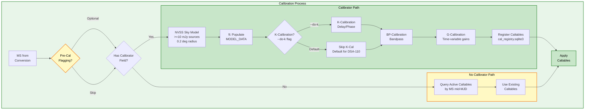

**Details:**

- **Pre-Calibration Flagging**: Optional step that resets flags, flags zeros,
  and optionally flags RFI (tfcrop + rflag). May be skipped in streaming mode
  when using existing caltables.
- **K-Calibration**: Skipped by default (short baselines, delays <0.5 ns
  absorbed into gains)
- **BP-Calibration**: Frequency-dependent gains, uses "G" mode
- **G-Calibration**: Time-variable atmospheric effects, uses "p" (phase-only)
  mode in development tier
- **Fast Mode**: Time/channel binning, phase-only gains, uvrange cuts
- **Registry**: All caltables registered with validity windows for automatic
  selection

---

### Stage 4: Apply Calibration

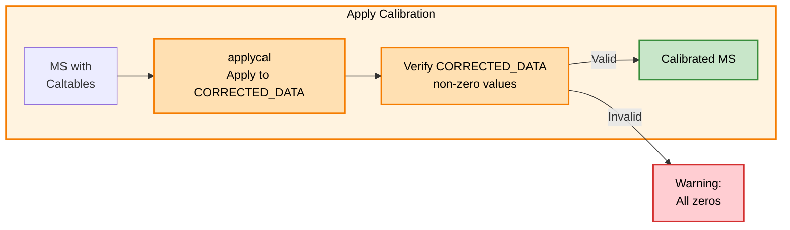

**Details:**

- **Process**: `applycal` writes calibrated visibilities to `CORRECTED_DATA`
- **Validation**: Ensures corrected data is populated (not all zeros)
- **Registry**: Queries active caltables by MS mid-MJD for automatic selection

---

### Stage 5: Imaging

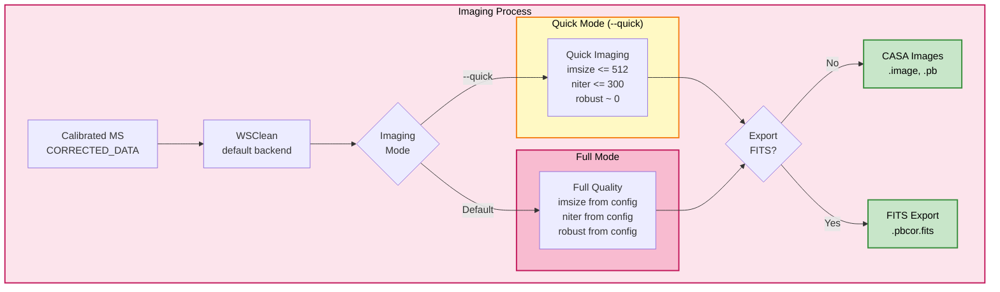

**Details:**

- **Backend**: WSClean is the default (2-5x faster than tclean). tclean
  available via `--backend tclean`.
- **Quick Mode**: For speed and operator QA, reduced parameters
- **Full Mode**: Production quality with full deconvolution
- **PB Correction**: Primary beam correction always applied
- **FITS Export**: Optional for speed (CASA images sufficient for CASA tools)

---

### Stage 6: Products and Indexing

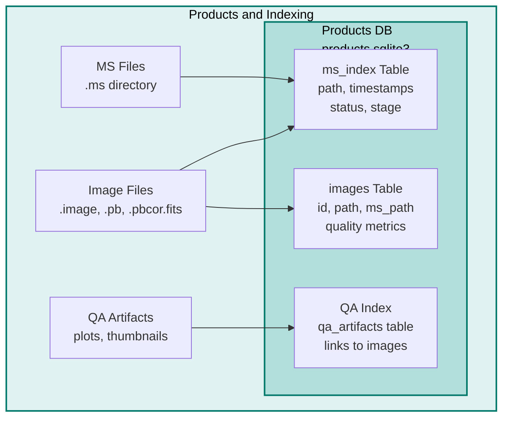

**Details:**

- **MS Index**: Tracks all Measurement Sets with metadata and processing status
- **Image Index**: Tracks all images with quality metrics
- **QA Index**: Links QA artifacts (plots, thumbnails) to images
- **Status Tracking**: `status` field tracks processing state, `stage` tracks
  current stage

---

### Stage 7: Monitoring & Access

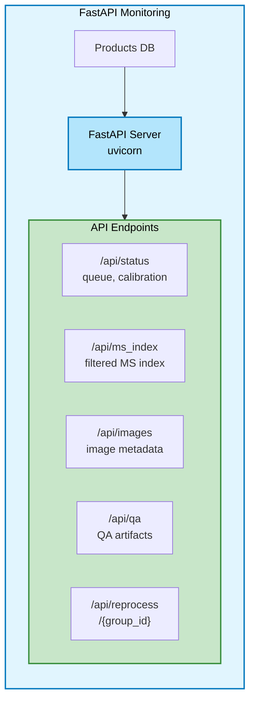

**Details:**

- **Status Endpoints**: Real-time queue and system status
- **Product Endpoints**: Filtered access to MS index and images
- **QA Endpoints**: Serve QA plots and thumbnails
- **Reprocessing**: Manual trigger to reprocess failed groups

---

## State Machine & Queue Management

### Queue State Transitions

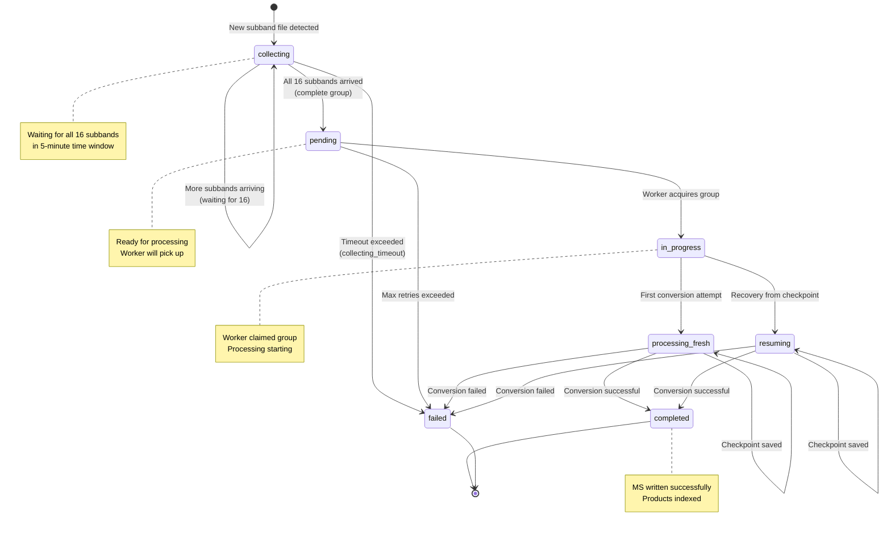

**State Details:**

- **collecting**: Waiting for all 16 subbands to arrive
- **pending**: Complete group ready for processing
- **in_progress**: Worker has claimed the group
- **processing_fresh**: First conversion attempt (no checkpoint)
- **resuming**: Recovery from existing checkpoint
- **completed**: Successfully processed and indexed
- **failed**: Exceeded retry budget or unrecoverable error

### Stage Tracking

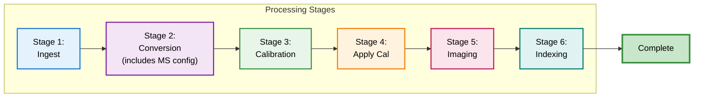

**Stage Field**: Tracks current processing stage in `ms_index` table for
monitoring and debugging.

**Note:** MS configuration (MODEL_DATA, CORRECTED_DATA, WEIGHT_SPECTRUM
initialization) happens during Stage 2 conversion finalization, not as a
separate stage.

---

## Data Products & Artifacts

### File Structure

```
/data/ms/
├── 2025-11-02T13:40:03.ms/          # Measurement Set (directory)
│   ├── ANTENNA
│   ├── DATA
│   ├── FIELD
│   ├── SPECTRAL_WINDOW
│   └── ...
├── 2025-11-02T13:40:03.bpcal/       # Bandpass calibration table
├── 2025-11-02T13:40:03.gcal/        # Gain calibration table
├── 2025-11-02T13:40:03.image/       # CASA image (directory)
│   ├── image
│   ├── mask
│   └── ...
├── 2025-11-02T13:40:03.pb/          # Primary beam image
└── 2025-11-02T13:40:03.pbcor.fits   # Primary beam corrected FITS
```

### Database Schema

**Queue DB (`ingest.sqlite3`):**

- `ingest_queue`: Group state and metadata
- `subband_files`: Individual file tracking
- `performance_metrics`: Conversion timings and writer type

**Cal Registry DB (`cal_registry.sqlite3`):**

- `caltables`: Calibration table registry with validity windows

**Products DB (`products.sqlite3`):**

- `ms_index`: MS metadata and processing status
- `images`: Image metadata and quality metrics
- `qa_artifacts`: QA plots and thumbnails

---

## Database Interactions

### Data Flow Through Databases

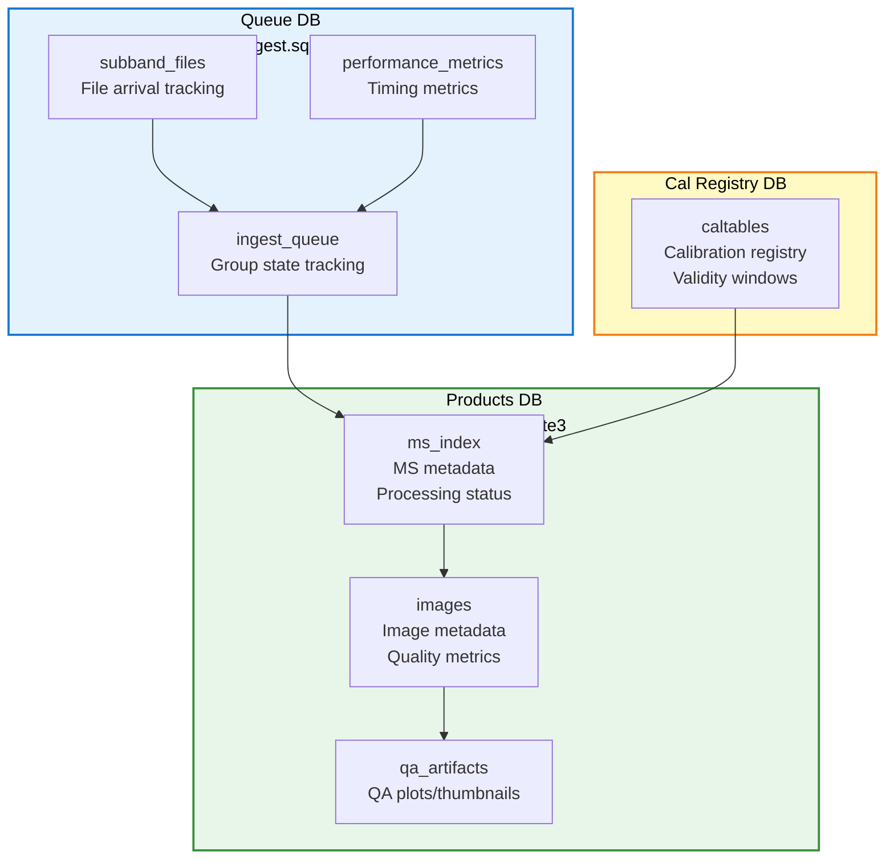

**Key Interactions:**

1. **Queue DB**: Tracks ingestion and conversion state
2. **Cal Registry**: Manages calibration table validity and selection
3. **Products DB**: Central repository for all processing products

---

## Performance Optimization Paths

### Fast Path Options

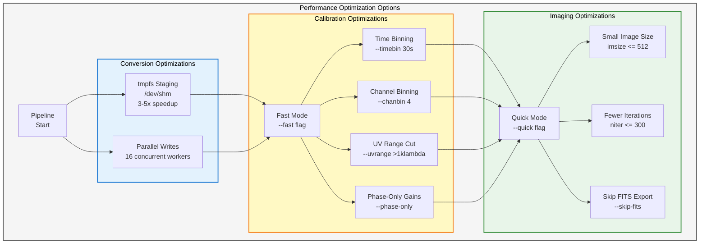

**Optimization Summary:**

- **Conversion**: tmpfs staging + parallel writes = 3-5x speedup
- **Calibration**: Fast mode with binning and cuts = 2-3x speedup
- **Imaging**: Quick mode with reduced parameters = 2-4x speedup
- **Combined**: Can achieve 10-20x overall speedup for quick-look processing

---

## Summary

This visualization provides a comprehensive view of the DSA-110 continuum
imaging pipeline workflow:

1. **Continuous Ingestion**: Automated monitoring and grouping of UVH5 files
2. **Efficient Conversion**: Strategy-based conversion with performance
   optimizations
3. **Robust Calibration**: Flexible calibration with automatic table management
4. **Quality Imaging**: Configurable imaging with quick-look options
5. **Complete Indexing**: All products tracked in SQLite databases
6. **Full Monitoring**: API access to all pipeline components and products

**Key Design Principles:**

- **Modular**: Each stage is independent and testable
- **Resilient**: State tracking and checkpointing for recovery
- **Flexible**: Multiple optimization paths for different use cases
- **Observable**: Comprehensive logging and API monitoring

---

**Related Documentation:**

- `docs/pipeline.md` - Pipeline overview with decision points
- `docs/quickstart.md` - Quick start guide
- `docs/howto/PIPELINE_TESTING_GUIDE.md` - Testing procedures
- `MEMORY.md` - Codebase understanding and design decisions
