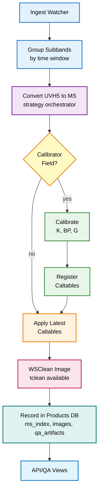
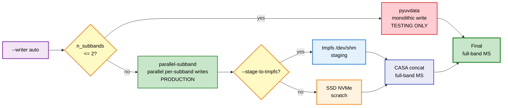
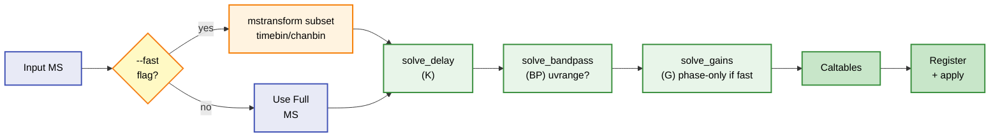
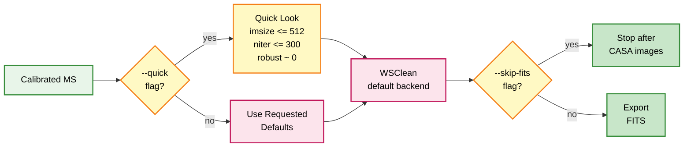

# Pipeline Visuals

This page illustrates the streaming continuum imaging pipeline from ingest to products, plus decision points and fast-path options for speed.

**For a comprehensive, detailed workflow visualization with complete stage breakdowns, see [Pipeline Workflow Visualization](pipeline_workflow_visualization.md).**

## End-to-end Flow

Notes:
- Conversion uses a strategy pattern and can stage to tmpfs for speed.
- Calibration supports quality tiers with explicit trade-offs for different use cases.
- Imaging supports quality tiers: "standard" (recommended for science), "development" (⚠️ NON-SCIENCE), "high_precision" (enhanced quality).

## Conversion: Writer Selection and Staging

- **Production**: Always uses `parallel-subband` writer for 16 subbands (default).
- **Testing**: `pyuvdata` writer is available for testing scenarios with <=2 subbands only.
- `auto` mode selects `parallel-subband` for production (16 subbands) or `pyuvdata` for testing (<=2 subbands).
- **Note**: `direct-subband` is an alias for `parallel-subband` (backward compatibility).
- tmpfs staging reduces filesystem latency for part writes and final concat.

## Calibration: Fast Path

- Typical fast knobs: `--timebin 30s`, `--chanbin 4`, `--uvrange >1klambda`, phase-only gains.

## Imaging: Quick-look Options

- Quick-look is for speed and operator QA; omit `--quick` and `--skip-fits` for full-quality products.
- **Imaging backend**: WSClean is the default (2-5x faster than tclean). tclean is available via `--backend tclean`.
