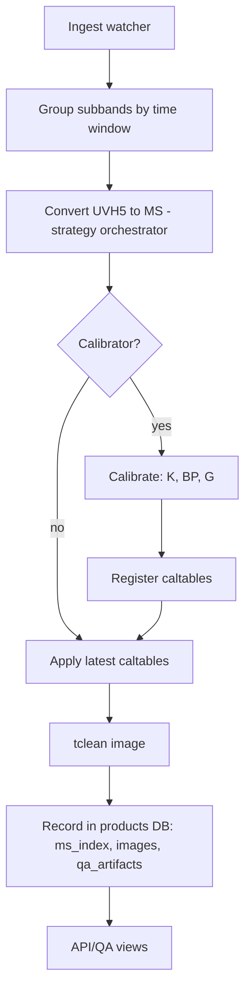
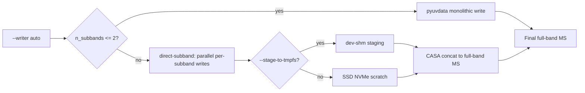
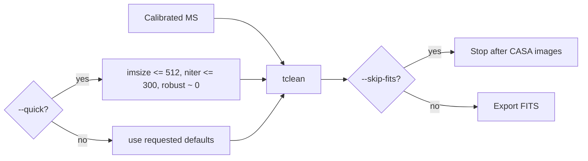

# Pipeline Visuals

This page illustrates the streaming continuum imaging pipeline from ingest to products, plus decision points and fast-path options for speed.

## End-to-end Flow



Notes:
- Conversion uses a strategy pattern and can stage to tmpfs for speed.
- Calibration can run a "fast" path (subset + phase-only + uvrange) for quick-look.
- Imaging can run a "quick" mode (smaller imsize, fewer iterations) and skip FITS export.

## Conversion: Writer Selection and Staging



- Auto is faster because it avoids concat overhead for very small N and exploits parallelism + RAM for larger N.
- tmpfs staging reduces filesystem latency for part writes and final concat.

## Calibration: Fast Path

```mermaid
flowchart LR
  MSIn[Input MS] --> Fast{--fast?}
  Fast -->|yes| Subset[mstransform subset (timebin/chanbin)]
  Fast -->|no| Full[use full MS]
  Subset --> K[solve_delay (K)]
  Full --> K
  K --> BP[solve_bandpass (BP) uvrange?]
  BP --> G[solve_gains (G): phase-only if fast]
  G --> Tabs[Caltables]
  Tabs --> Reg[Register + apply]
```

- Typical fast knobs: `--timebin 30s`, `--chanbin 4`, `--uvrange >1klambda`, phase-only gains.

## Imaging: Quick-look Options



- Quick-look is for speed and operator QA; omit `--quick` and `--skip-fits` for full-quality products.
