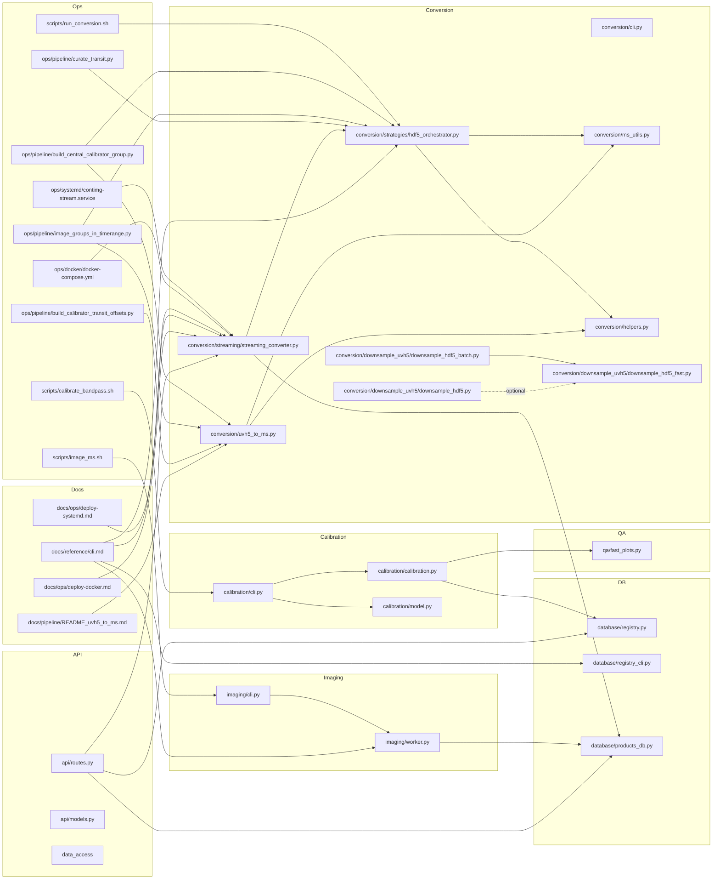

# Module Interconnections

This diagram shows high-level dependencies among actively used modules, ops scripts, and docs.

```mermaid
graph LR
  subgraph Ops
    OPS_STREAM[ops/systemd/contimg-stream.service]
    OPS_DOCKER[ops/docker/docker-compose.yml]
    OPS_PIPE_BUILD[ops/pipeline/build_central_calibrator_group.py]
    OPS_PIPE_IMAGE[ops/pipeline/image_groups_in_timerange.py]
    OPS_PIPE_OFFSETS[ops/pipeline/build_calibrator_transit_offsets.py]
    OPS_PIPE_CURATE[ops/pipeline/curate_transit.py]
    OPS_RUN_CONV[scripts/run_conversion.sh]
    OPS_CAL_BP[scripts/calibrate_bandpass.sh]
    OPS_IMAGE_MS[scripts/image_ms.sh]
  end

  subgraph Conversion
    CLI_CONV[conversion/cli.py]
    UVH5_TO_MS[conversion/uvh5_to_ms.py]
    HDF5_ORCH[conversion/strategies/hdf5_orchestrator.py]
    STREAMING[conversion/streaming/streaming_converter.py]
    MS_UTILS[conversion/ms_utils.py]
    HELPERS[conversion/helpers.py]
    DS_FAST[conversion/downsample_uvh5/downsample_hdf5_fast.py]
    DS_SINGLE[conversion/downsample_uvh5/downsample_hdf5.py]
    DS_BATCH[conversion/downsample_uvh5/downsample_hdf5_batch.py]
  end

  subgraph Calibration
    CAL_CLI[calibration/cli.py]
    CAL_CORE[calibration/calibration.py]
    CAL_MODEL[calibration/model.py]
  end

  subgraph Imaging
    IMG_CLI[imaging/cli.py]
    IMG_WORKER[imaging/worker.py]
  end

  subgraph DB
    DB_REG[database/registry.py]
    DB_REG_CLI[database/registry_cli.py]
    DB_PRODUCTS[database/products_db.py]
  end

  subgraph QA
    QA_FAST[qa/fast_plots.py]
  end

  subgraph API
    API_ROUTES[api/routes.py]
    API_MODELS[api/models.py]
    API_DA[data_access]
  end

  subgraph Docs
    DOCS_CLI[docs/reference/cli.md]
    DOCS_PIPE[docs/pipeline/README_uvh5_to_ms.md]
    DOCS_DEP_SYS[docs/ops/deploy-systemd.md]
    DOCS_DEP_DOCK[docs/ops/deploy-docker.md]
  end

  %% Ops -> Modules
  OPS_STREAM --> STREAMING
  OPS_DOCKER --> STREAMING
  OPS_RUN_CONV --> HDF5_ORCH
  OPS_PIPE_BUILD --> UVH5_TO_MS
  OPS_PIPE_BUILD --> HDF5_ORCH
  OPS_PIPE_IMAGE --> UVH5_TO_MS
  OPS_PIPE_IMAGE --> HDF5_ORCH
  OPS_PIPE_OFFSETS --> UVH5_TO_MS
  OPS_PIPE_CURATE --> HDF5_ORCH
  OPS_CAL_BP --> CAL_CLI
  OPS_IMAGE_MS --> IMG_CLI

  %% Conversion internals
  HDF5_ORCH --> MS_UTILS
  HDF5_ORCH --> HELPERS
  UVH5_TO_MS --> MS_UTILS
  UVH5_TO_MS --> HELPERS
  STREAMING --> HDF5_ORCH
  STREAMING --> DB_PRODUCTS

  %% Calibration flow
  CAL_CLI --> CAL_CORE
  CAL_CLI --> CAL_MODEL
  CAL_CORE --> DB_REG
  CAL_CORE --> QA_FAST

  %% Imaging flow
  IMG_CLI --> IMG_WORKER
  IMG_WORKER --> DB_PRODUCTS

  %% Downsample tools
  DS_BATCH --> DS_FAST
  DS_SINGLE -. optional .-> DS_FAST

  %% Docs
  DOCS_CLI --> STREAMING
  DOCS_CLI --> HDF5_ORCH
  DOCS_CLI --> IMG_WORKER
  DOCS_CLI --> DB_REG_CLI
  DOCS_PIPE --> UVH5_TO_MS
  DOCS_DEP_SYS --> STREAMING
  DOCS_DEP_DOCK --> STREAMING
  API_ROUTES --> DB_PRODUCTS
  API_ROUTES --> DB_REG
  API_ROUTES --> STREAMING
```
