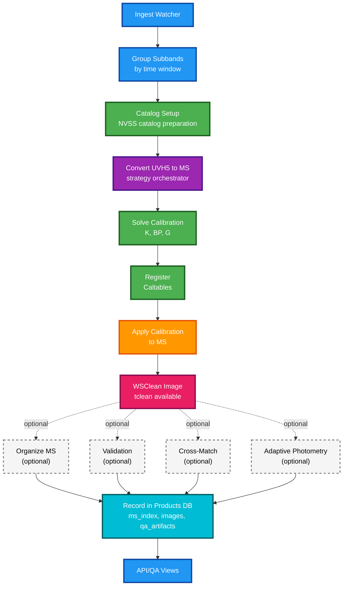

# Mermaid Diagrams Evaluation

**Date:** 2025-11-12  
**Status:** Analysis Complete

---

## Current State Analysis

After rendering and reviewing all Mermaid diagrams in the documentation, here are my findings:

---

## Diagrams Found

1. **Pipeline Overview** (`pipeline_overview.md`) - Main workflow flowchart
2. **Pipeline Workflow Visualization** (`pipeline_workflow_visualization.md`) - Detailed stage-by-stage breakdown
3. **Architecture Overview** (`architecture.md`) - High-level data flow
4. **Writer Selection** (`pipeline_overview.md`) - Decision tree for writer selection
5. **Modules** (`modules.md`) - Module structure diagram

---

## Evaluation Against Reference Standards

### Reference Image Characteristics
The provided reference images demonstrate:
- **Vibrant color palettes** with high contrast
- **Clear visual hierarchy** through color grouping
- **Dynamic layouts** with branching paths
- **Professional appearance** with consistent styling
- **Easy to follow** flow with distinct path colors

### Current Diagram Strengths

#### ✅ Clarity
- **Text is readable** - All labels are clear and concise
- **Flow is logical** - Sequential progression is easy to follow
- **Decision points are clear** - Diamond shapes with labeled branches
- **Subgraphs organize content** - Good use of grouping in detailed diagrams

#### ✅ Functionality
- **Color coding exists** - Different stages use different colors
- **Consistent shapes** - Rectangles for processes, diamonds for decisions
- **Proper arrow directions** - Flow direction is unambiguous

### Current Diagram Weaknesses

#### ⚠️ Visual Appeal Issues

**1. Color Palette Too Muted**
- Current colors are pastel/light (e.g., `#E3F2FD`, `#E8F5E9`)
- Reference images use **vibrant, saturated colors** with better contrast
- Colors don't "pop" - they blend into the background

**2. Insufficient Color Contrast**
- Light fills with dark strokes work, but lack visual impact
- Reference images show **stronger contrast** between elements
- Decision points (yellow) could be more prominent

**3. Limited Visual Hierarchy**
- All nodes have similar visual weight
- Reference images use **color intensity** to show importance
- No clear "primary path" vs "secondary path" distinction

**4. Layout Could Be More Dynamic**
- Some diagrams are very linear (especially `flowchart TB`)
- Reference images show **branching paths** with distinct colors
- Could benefit from more visual separation of parallel processes

**5. Missing Visual Grouping**
- Subgraphs help, but could use **background colors** or borders
- Reference images show clear **grouped outcomes** with containers
- Related stages could be visually connected better

---

## Specific Diagram Analysis

### 1. Pipeline Overview (Main Workflow)

**Current:**
- 14 nodes in a linear vertical flow
- Color coding: Blue (ingest), Green (calibration), Purple (conversion), Orange (apply), Pink (imaging), Teal (optional steps)
- All nodes same size and weight

**Issues:**
- Very long vertical layout (hard to see all at once)
- Optional steps blend in (all teal) - could use different styling
- No visual distinction between "core" and "optional" paths

**Recommendations:**
- Use **darker, more saturated colors** for core stages
- Make optional steps visually distinct (dashed borders? lighter fill?)
- Consider horizontal layout or grouping stages

### 2. Pipeline Workflow Visualization (Detailed)

**Current:**
- 9 subgraphs with detailed internal flows
- Good organization but very dense
- Uses default Mermaid subgraph styling

**Issues:**
- Subgraphs don't have distinct background colors
- Very long vertical layout
- Hard to see relationships between stages

**Recommendations:**
- Add **background colors to subgraphs** to match stage themes
- Use **stronger colors** for stage boundaries
- Consider splitting into multiple diagrams if too dense

### 3. Architecture Overview (High-Level Flow)

**Current:**
- Horizontal flow with one decision point
- Color coding present but muted
- Clear branching logic

**Issues:**
- Colors are too light
- Decision point (yellow) could be more prominent
- Parallel paths could be visually separated

**Recommendations:**
- **Brighten colors** - use more saturated versions
- Make decision diamond **larger/more prominent**
- Use **different path colors** for Yes/No branches

### 4. Writer Selection (Decision Tree)

**Current:**
- Simple decision tree
- No color styling applied
- Very basic appearance

**Issues:**
- **No color coding** at all
- Looks unfinished compared to others
- Missing visual appeal

**Recommendations:**
- Add **color coding** for different paths (production vs testing)
- Use **distinct colors** for decision outcomes
- Make production path more prominent

---

## Recommendations for Improvement

### Priority 1: Color Enhancement

**Action:** Replace muted pastels with vibrant, saturated colors

**Example Transformation:**
```mermaid
# Before (muted)
style Ingest fill:#E3F2FD,stroke:#1976D2

# After (vibrant)
style Ingest fill:#2196F3,stroke:#0D47A1,stroke-width:3px
```

**Color Palette Suggestions:**
- **Ingest/Input:** Bright Blue (`#2196F3` / `#0D47A1`)
- **Calibration:** Vibrant Green (`#4CAF50` / `#1B5E20`)
- **Conversion:** Rich Purple (`#9C27B0` / `#4A148C`)
- **Imaging:** Bold Pink (`#E91E63` / `#880E4F`)
- **Optional Steps:** Light Gray with dashed borders (`#BDBDBD` / `#424242`)
- **Decision Points:** Bright Orange/Yellow (`#FF9800` / `#E65100`)

### Priority 2: Visual Hierarchy

**Action:** Make core path more prominent than optional steps

**Techniques:**
- **Thicker strokes** for core stages (3-4px vs 2px)
- **Darker fills** for primary path
- **Lighter fills + dashed borders** for optional steps
- **Larger nodes** for critical stages

### Priority 3: Path Color Coding

**Action:** Use distinct colors for different flow paths

**Example:**
- **Production path:** Blue tones
- **Testing path:** Orange/Red tones
- **Optional path:** Gray tones
- **Error path:** Red tones

### Priority 4: Subgraph Styling

**Action:** Add background colors and borders to subgraphs

**Mermaid Support:**
```mermaid
subgraph STAGE["Stage Name"]
  style STAGE fill:#E8F5E9,stroke:#388E3C,stroke-width:3px
  ...
end
```

### Priority 5: Layout Optimization

**Action:** Consider alternative layouts for better visual flow

**Options:**
- **Horizontal layouts** for long sequences
- **Grouped clusters** for related stages
- **Circular/radial** layouts for complex branching
- **Split views** for parallel processes

---

## Comparison Matrix

| Aspect | Current Diagrams | Reference Images | Gap |
|--------|-----------------|------------------|-----|
| **Color Vibrancy** | Muted pastels | Vibrant, saturated | High |
| **Contrast** | Moderate | High | Medium |
| **Visual Hierarchy** | Flat | Clear distinction | High |
| **Path Clarity** | Good | Excellent | Low |
| **Professional Look** | Functional | Polished | Medium |
| **Ease of Following** | Good | Excellent | Low |

---

## Implementation Plan

### Phase 1: Quick Wins (High Impact, Low Effort)
1. Replace color palette with vibrant colors
2. Increase stroke widths for core stages
3. Add styling to writer selection diagram
4. Make decision points more prominent

### Phase 2: Enhanced Styling (Medium Effort)
1. Add subgraph background colors
2. Implement visual hierarchy (thicker strokes, larger nodes)
3. Style optional steps differently (dashed borders)
4. Add path color coding

### Phase 3: Layout Improvements (Higher Effort)
1. Optimize layouts for better flow
2. Split dense diagrams into focused views
3. Add visual grouping containers
4. Consider alternative diagram types

---

## Example Improved Diagram

Here's how the Pipeline Overview could look with improvements:



**Key Improvements:**
- ✅ Vibrant, saturated colors
- ✅ Thicker strokes (3px) for core path
- ✅ White text on dark backgrounds for contrast
- ✅ Dashed borders for optional steps
- ✅ Dotted arrows for optional paths

---

## Conclusion

**Current State:** Functional but visually muted. Diagrams are clear and easy to follow, but lack the visual appeal and professional polish seen in the reference images.

**Main Issues:**
1. Colors too muted/pastel
2. Insufficient visual hierarchy
3. Optional steps blend in
4. Missing vibrant color coding

**Recommendation:** Implement Phase 1 improvements (color enhancement) for immediate visual impact. This will bring the diagrams closer to the reference standard while maintaining clarity and functionality.

---

## Next Steps

1. **Review this evaluation** with stakeholders
2. **Prioritize improvements** based on usage and importance
3. **Implement Phase 1** (quick wins) first
4. **Test rendered output** to ensure readability
5. **Iterate** based on feedback

