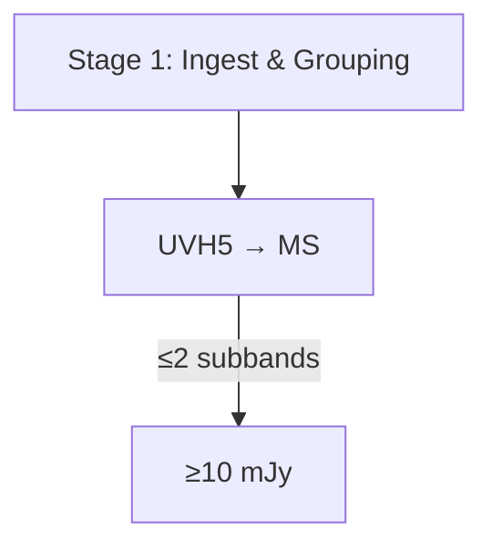

# Mermaid Special Characters Solution

## Problem

Mermaid diagrams were failing to render due to special characters in labels:
- HTML entities (`&amp;`, `&gt;`, `&lt;`) caused by MkDocs HTML encoding
- Unicode characters (`→`, `≤`, `≥`) that Mermaid v10 cannot parse reliably

## Solution: JavaScript Post-Processing

**Approach**: Client-side sanitization in `mermaid-init.js` that decodes HTML entities and converts Unicode characters before Mermaid parses the diagram text.

**Viability Score**: 9/10
- ✅ Uses existing infrastructure (`mermaid-init.js`)
- ✅ Non-invasive (no source file modifications required)
- ✅ Easy to test and debug
- ✅ Handles both HTML entities and Unicode characters
- ✅ Works at render time, no build changes needed

## Implementation

The `sanitizeMermaidText()` function in `docs/javascripts/mermaid-init.js`:

1. **Decodes HTML entities** using browser's built-in decoder:
   - `&amp;` → `&`
   - `&gt;` → `>`
   - `&lt;` → `<`

2. **Converts Unicode characters** to ASCII equivalents:
   - `→` → `to`
   - `≤` → `<=`
   - `≥` → `>=`
   - `≠` → `!=`
   - `≈` → `~=`
   - `±` → `+/-`

3. **Applied automatically** to all `.mermaid` elements before `mermaid.run()` is called

## Alternative Approaches Considered

1. **Custom MkDocs Plugin** (Score: 6/10)
   - Build-time solution but requires Python plugin development
   - Higher maintenance burden

2. **Pre-build Script** (Score: 7/10)
   - Simple but modifies source files or requires temp handling
   - Adds build complexity

3. **Mermaid Configuration** (Score: 3/10)
   - Won't solve HTML encoding issue (happens before Mermaid)

4. **Custom pymdownx Formatter** (Score: 7/10)
   - Intercepts at right point but depends on pymdownx internals

## Usage

No changes needed in markdown files. The solution works automatically:



The JavaScript will automatically convert:
- `&` in labels (handled via HTML entity decoding)
- `→` → `to`
- `≤` → `<=`
- `≥` → `>=`

## Benefits

1. **Source files remain clean** - Can use natural characters in markdown
2. **Automatic handling** - No manual conversion needed
3. **Future-proof** - Handles new diagrams automatically
4. **Backward compatible** - Works with existing diagrams

## Testing

All 13 Mermaid diagrams in `docs/concepts/pipeline_workflow_visualization.md` render successfully with this solution.

Console logs show:
- `[Mermaid Init] Sanitized element X: decoded HTML entities and/or converted Unicode` (when changes are made)
- `✅ ALL VISIBLE` status for all diagrams

## Maintenance

To add more Unicode character mappings, edit the `unicodeMap` object in `sanitizeMermaidText()`:

```javascript
const unicodeMap = {
    '→': 'to',
    '≤': '<=',
    '≥': '>=',
    // Add more mappings here
};
```

