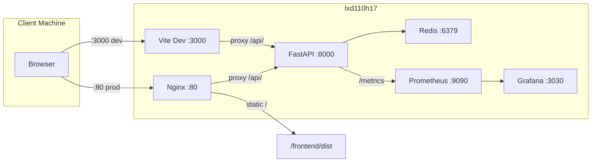
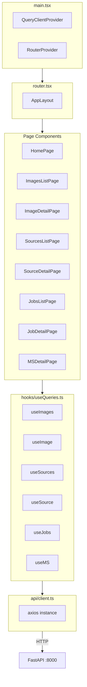
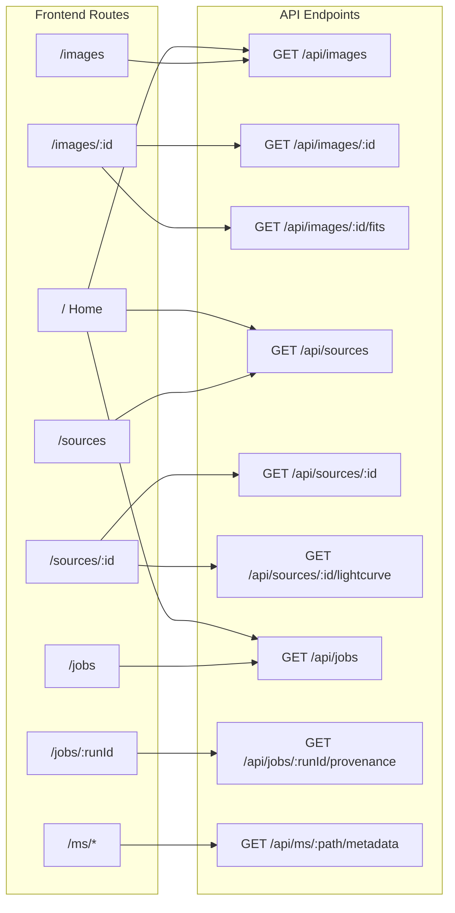
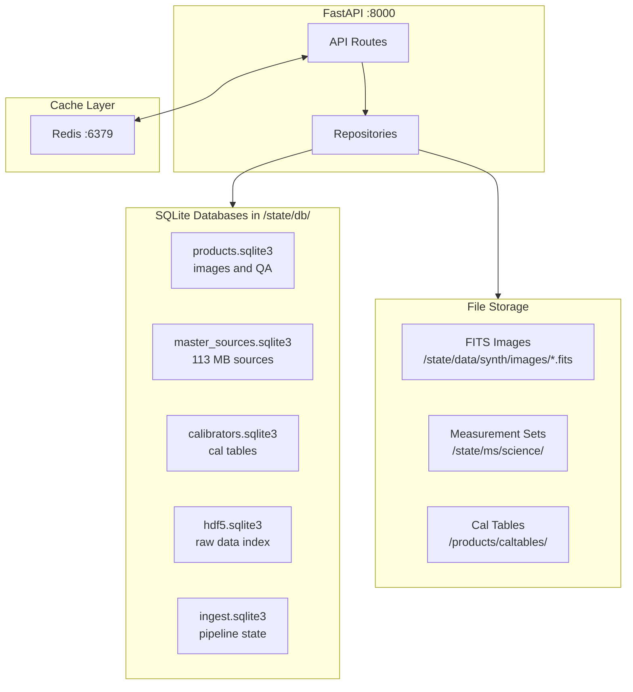
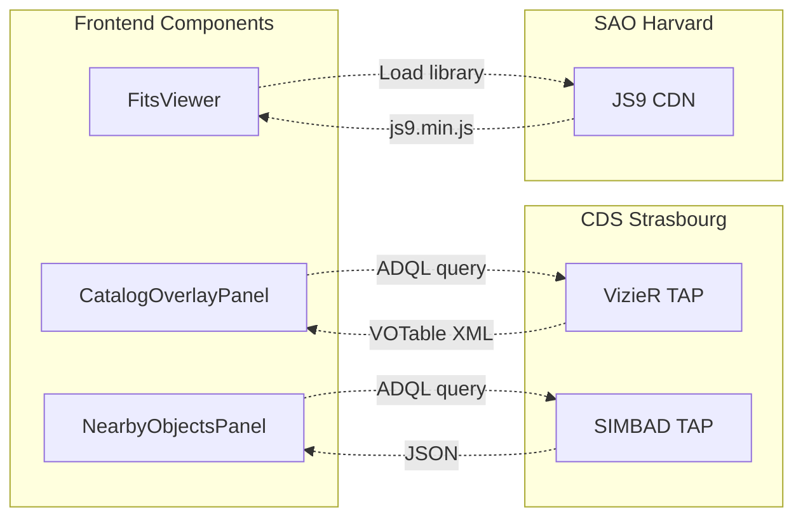
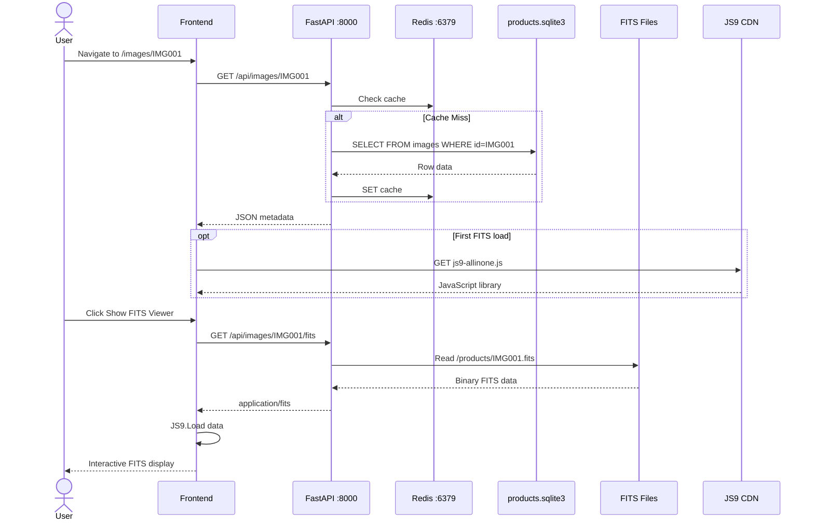
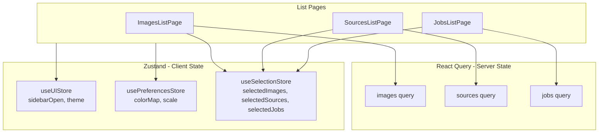
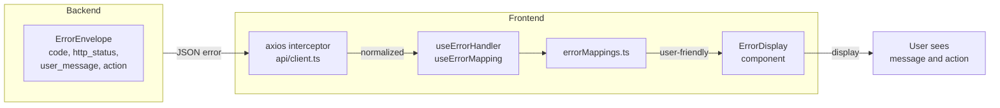

# DSA-110 Continuum Imaging Frontend Architecture

> **Legend**: Solid lines = data flow | Dotted lines = external requests | Thick
> lines = primary path

---

## 1. Deployment Topology

Shows the physical layout of services and ports.



---

## 2. Frontend Application Structure

Shows React component and data flow architecture.



---

## 3. Page to API Mapping

Which page calls which endpoints.



---

## 4. Backend Data Layer

Shows actual SQLite databases and file storage.



---

## 5. External Service Integration

Frontend-initiated requests to astronomical services.



**External URLs:**

- JS9: `https://js9.si.edu/js9/js9-allinone.js`
- VizieR: `https://tapvizier.cds.unistra.fr/TAPVizieR/tap/sync`
- SIMBAD: `https://simbad.u-strasbg.fr/simbad/sim-tap/sync`

---

## 6. Image Detail Data Flow

Complete flow when viewing an image with FITS viewer.



---

## 7. State Management

How client-side state is managed.



---

## 8. Error Handling Flow

How errors propagate from API to user.



---

## 9. Component to Page Mapping

Verified imports from each page file.

| Page                 | Components Used                                                                             |
| -------------------- | ------------------------------------------------------------------------------------------- |
| **HomePage**         | StatCardGrid, SkyCoverageMap, StatsDashboard                                                |
| **ImagesListPage**   | FilterPanel, FitsViewerGrid, BulkDownloadPanel, useSelectionStore                           |
| **ImageDetailPage**  | FitsViewer, RatingCard, AladinLiteViewer, GifPlayer, ProvenanceStrip, ErrorDisplay          |
| **SourcesListPage**  | AdvancedQueryPanel, EtaVPlot, AdvancedFilterPanel, Modal, useSelectionStore                 |
| **SourceDetailPage** | CatalogOverlayPanel, NearbyObjectsPanel, AladinLiteViewer, LightCurveChart, ProvenanceStrip |
| **JobsListPage**     | useSelectionStore                                                                           |
| **JobDetailPage**    | ProvenanceStrip                                                                             |

---

## Port Reference

| Port | Service    | Purpose                  | Config                                      | Verified |
| ---- | ---------- | ------------------------ | ------------------------------------------- | -------- |
| 80   | Nginx      | Production reverse proxy | `/etc/nginx/sites-available/dsa110-contimg` | -        |
| 3000 | Vite       | Dev server               | `vite.config.ts`                            | Yes      |
| 8000 | FastAPI    | Backend API              | `CONTIMG_API_PORT` env var                  | Yes      |
| 6379 | Redis      | Response caching         | `REDIS_PORT` env var                        | Yes      |
| 9090 | Prometheus | Metrics scraping         | `/etc/prometheus/prometheus.yml`            | Yes      |
| 3030 | Grafana    | Dashboards               | `/etc/grafana/grafana.ini`                  | Yes      |

---

## Quick Reference

### URLs in Development

| Resource | URL                              |
| -------- | -------------------------------- |
| Frontend | http://localhost:3000            |
| API Docs | http://localhost:8000/api/docs   |
| Health   | http://localhost:8000/api/health |
| Grafana  | http://localhost:3030            |

### Environment

```bash
# Frontend .env
VITE_API_URL=http://localhost:8000

# Backend systemd or shell
CONTIMG_API_PORT=8000
REDIS_PORT=6379
```

### Key Files

| Purpose            | Path                             |
| ------------------ | -------------------------------- |
| API client         | `src/api/client.ts`              |
| Resilience modules | `src/api/resilience/`            |
| Query hooks        | `src/hooks/useQueries.ts`        |
| Custom hooks       | `src/hooks/use*.ts`              |
| Router             | `src/router.tsx`                 |
| Route constants    | `src/constants/routes.ts`        |
| State stores       | `src/stores/appStore.ts`         |
| Error mappings     | `src/constants/errorMappings.ts` |
| API types          | `src/types/api.ts`               |
| Error boundaries   | `src/components/errors/`         |

---

## 10. Code Architecture Patterns

### Type System

All API response types are centralized in `src/types/api.ts`:

```typescript
// Base entity with common fields
interface BaseEntity {
  id: string;
  created_at?: string;
  updated_at?: string;
}

// Mixin types for composition
interface WithProvenance {
  job_id?: string;
  run_id?: string;
  ms_path?: string;
  cal_table?: string;
}

interface WithCoordinates {
  ra_deg: number;
  dec_deg: number;
}

// Entity types compose mixins
interface ImageSummary extends BaseEntity, WithProvenance { ... }
interface SourceDetail extends BaseEntity, WithCoordinates, WithProvenance { ... }
```

### Route Constants

Routes are centralized in `src/constants/routes.ts`:

```typescript
export const ROUTES = {
  HOME: "/",
  IMAGES: {
    LIST: "/images",
    DETAIL: (id: string) => `/images/${encodeURIComponent(id)}`,
  },
  SOURCES: {
    LIST: "/sources",
    DETAIL: (id: string) => `/sources/${encodeURIComponent(id)}`,
  },
  // ...
} as const;
```

### API Client Resilience

The API client uses a modular resilience layer in `src/api/resilience/`:

```
src/api/resilience/
├── types.ts          # RetryConfig, CircuitBreakerConfig
├── circuit-breaker.ts # Circuit breaker state machine
├── retry.ts          # Retry logic with exponential backoff
└── index.ts          # Barrel exports
```

### Custom Hooks

Complex page logic is extracted into focused hooks:

| Hook                 | Purpose                             | Status        |
| -------------------- | ----------------------------------- | ------------- |
| `useImageDetail`     | Image detail page data & operations | ✅ Integrated |
| `useUrlFilterState`  | URL-based filter state for sharing  | ✅ Integrated |
| `useSourceFiltering` | Source list filtering logic         | ✅ Integrated |

All hooks are fully integrated:

- `useImageDetail` in `ImageDetailPage` - handles delete, rating, recent items
- `useUrlFilterState` in `SourcesListPage` - shareable/bookmarkable filter URLs
- `useSourceFiltering` in `SourcesListPage` - centralized filtering logic

**URL State Pattern:** The `SourcesListPage` uses URL search params
(`?ra=180&minFlux=0.1`) for filter state via `useUrlFilterState`. The
`AdvancedQueryPanel` is configured with `disableUrlSync` to prevent conflicts
with its internal hash-based URL sync.

### Error Boundaries

Error boundaries wrap visualization widgets to prevent crashes:

```tsx
<WidgetErrorBoundary widgetName="FITS Viewer" minHeight={500}>
  <FitsViewer ... />
</WidgetErrorBoundary>
```

### Loading States

Consistent skeleton loading using `PageSkeleton`:

```tsx
if (isLoading) {
  return <PageSkeleton variant="detail" showHeader showSidebar />;
}
```

Variants: `list`, `detail`, `cards`, `table`

---

## State Management Architecture

The application uses a **layered state management approach** with clear
boundaries of responsibility:

### 1. Server State (TanStack Query)

**Purpose:** All data fetched from the backend API

**Location:** `src/hooks/useQueries.ts`

**Rationale:** React Query handles caching, synchronization, background
refetching, and optimistic updates automatically. This eliminates the need for
manual cache management and reduces boilerplate.

**Examples:**

- Image, source, job data
- Provenance information
- MS metadata

**Benefits:**

- Automatic cache invalidation
- Background synchronization
- Optimistic updates
- Request deduplication

### 2. Global UI State (Zustand)

**Purpose:** Ephemeral UI state shared across components

**Location:** `src/stores/appStore.ts`

**Stores:**

- `useUIStore` - Sidebar, modals, notifications
- `useSelectionStore` - Multi-select state for bulk operations

**Rationale:** Zustand provides lightweight global state without the ceremony of
Redux. No providers needed, direct import where required.

**When to use:**

- Sidebar open/closed state
- Global notifications/toasts
- Bulk selection across pages
- Modal visibility

### 3. Persisted Preferences (Zustand + localStorage)

**Purpose:** User preferences that persist across sessions

**Location:** `src/stores/appStore.ts` (`usePreferencesStore`)

**Rationale:** Uses Zustand's `persist` middleware to automatically sync with
localStorage. Preferences like theme and recent items should survive page
refreshes.

**Examples:**

- Theme preference (light/dark/system)
- Default table page size
- Recent items (images, sources, jobs)

### 4. Local Component State (React useState)

**Purpose:** Component-specific state that doesn't need to be shared

**When to use:**

- Form inputs
- Toggle states (expand/collapse)
- Temporary UI state
- Component-specific modals

**Rationale:** Keep it simple. Use `useState` for ephemeral state that doesn't
need to escape the component boundary.

### 5. URL State (React Router + Custom Hooks)

**Purpose:** Shareable, bookmarkable application state

**Location:** `src/hooks/useUrlFilterState.ts`

**When to use:**

- Search filters
- Sort orders
- Pagination
- Active tabs

**Rationale:** Filter state in URLs enables users to share links to specific
views. Makes the application more transparent and enables browser back/forward.

**Example:** `?ra=180&dec=45&radius=10&minFlux=0.1&tab=variability`

### State Management Decision Tree

```text
Is it server data?
  → YES → Use TanStack Query (useImages, useSource, etc.)

Is it shared across many components?
  → YES → Use Zustand (useUIStore, useSelectionStore)

Should it persist across sessions?
  → YES → Use Zustand with persist (usePreferencesStore)

Should it be shareable via URL?
  → YES → Use URL state (useUrlFilterState)

Otherwise:
  → Use local React state (useState, useReducer)
```

### Configuration and Constants

**Location:** `src/config/index.ts`

**Purpose:** Centralized environment variables and configuration

**Rationale:** Eliminates duplication of `import.meta.env.VITE_*` across the
codebase. Single source of truth for all configuration values.

---

## Async Data Loading Patterns

This section documents recommended patterns for loading async data in components.

### 1. Simple Data Fetch (Recommended Default)

**Use for:** Single data source with loading/error states

**Pattern:**

```tsx
import { useImage } from "@/hooks/useQueries";

export function ImageDetailPage() {
  const { id } = useParams();
  const { data: image, isLoading, error } = useImage(id);

  if (isLoading) return <div>Loading...</div>;
  if (error) return <div>Error: {error.message}</div>;
  if (!image) return <div>Image not found</div>;

  return <div>{/* Render image */}</div>;
}
```

**When to use:**

- Single entity detail pages (ImageDetailPage, SourceDetailPage)
- Simple list pages without complex interactions
- Any component that needs one piece of server data

**Benefits:**

- Simple and readable
- Clear loading and error states
- TypeScript knows data is defined after null check

### 2. Suspense + Error Boundary (For Critical UI)

**Use for:** Pages where you want React to handle loading/error states

**Pattern:**

```tsx
// In router.tsx
<Route
  path="/images/:id"
  lazy={() => import("./pages/ImageDetailPage")}
  element={
    <ErrorBoundary fallback={<ErrorPage />}>
      <Suspense fallback={<PageSkeleton variant="detail" />}>
        <Outlet />
      </Suspense>
    </ErrorBoundary>
  }
/>

// In ImageDetailPage.tsx
export function ImageDetailPage() {
  const { id } = useParams();
  const { data: image } = useSuspenseQuery({
    queryKey: ["image", id],
    queryFn: () => fetchImage(id),
  });

  // No loading/error checks needed - Suspense/ErrorBoundary handle it
  return <div>{/* Render image */}</div>;
}
```

**When to use:**

- Pages with consistent layout (navigation, sidebar always visible)
- When you want declarative loading states at route level
- Complex pages with multiple Suspense boundaries

**Benefits:**

- Consistent loading UX across routes
- Component code focuses on happy path
- Easy to add skeletons for specific regions

### 3. Parallel Data Fetching

**Use for:** Pages that need multiple independent data sources

**Pattern:**

```tsx
export function SourceDetailPage() {
  const { id } = useParams();
  
  const { data: source, isLoading: sourceLoading } = useSource(id);
  const { data: crossmatches, isLoading: crossmatchLoading } = useCrossmatches(id);
  const { data: variability, isLoading: varLoading } = useVariability(id);

  const isLoading = sourceLoading || crossmatchLoading || varLoading;

  if (isLoading) return <PageSkeleton variant="detail" />;
  if (!source) return <div>Source not found</div>;

  return (
    <div>
      <SourceHeader source={source} />
      {crossmatches && <CrossmatchPanel data={crossmatches} />}
      {variability && <VariabilityPanel data={variability} />}
    </div>
  );
}
```

**When to use:**

- Detail pages with multiple data sections
- Dashboard pages with multiple widgets
- Pages where some data is optional

**Benefits:**

- All requests fire in parallel (faster page load)
- Optional data gracefully handled
- Easy to add incremental features

### 4. Dependent Queries

**Use for:** Data that depends on previous query results

**Pattern:**

```tsx
export function JobDetailPage() {
  const { runId } = useParams();
  
  // First fetch job metadata
  const { data: job, isLoading: jobLoading } = useJob(runId);
  
  // Then fetch images generated by this job
  const { data: images, isLoading: imagesLoading } = useImages({
    runId: job?.run_id,
    enabled: !!job?.run_id, // Only run if job exists
  });

  if (jobLoading) return <div>Loading job...</div>;
  if (!job) return <div>Job not found</div>;
  
  return (
    <div>
      <JobHeader job={job} />
      {imagesLoading ? (
        <div>Loading images...</div>
      ) : (
        <ImageGrid images={images} />
      )}
    </div>
  );
}
```

**When to use:**

- Query parameters depend on previous query results
- Multi-step wizards
- Dynamic forms where options depend on selections

**Benefits:**

- Automatic query chaining
- No manual effect dependencies
- TanStack Query handles the orchestration

### 5. Infinite Queries (Pagination)

**Use for:** Lists with "Load More" or infinite scroll

**Pattern:**

```tsx
export function ImagesListPage() {
  const {
    data,
    fetchNextPage,
    hasNextPage,
    isFetchingNextPage,
  } = useInfiniteQuery({
    queryKey: ["images"],
    queryFn: ({ pageParam = 0 }) => fetchImages({ offset: pageParam }),
    getNextPageParam: (lastPage) => lastPage.nextOffset,
  });

  const images = data?.pages.flatMap(page => page.images) ?? [];

  return (
    <div>
      <ImageGrid images={images} />
      {hasNextPage && (
        <button onClick={() => fetchNextPage()} disabled={isFetchingNextPage}>
          {isFetchingNextPage ? "Loading..." : "Load More"}
        </button>
      )}
    </div>
  );
}
```

**When to use:**

- Large lists with pagination
- Infinite scroll behavior
- "Load More" buttons

**Benefits:**

- Automatic page accumulation
- Scroll position preserved
- Built-in has-more detection

### Pattern Selection Guide

| Scenario | Recommended Pattern | Rationale |
|----------|-------------------|-----------|
| Single entity detail | Simple Data Fetch | Straightforward, explicit states |
| List page | Simple Data Fetch | Clear loading/error handling |
| Dashboard | Parallel Fetching | Maximize performance |
| Wizard/Multi-step | Dependent Queries | Automatic query chaining |
| Infinite scroll | Infinite Queries | Built-in pagination logic |
| Critical UI path | Suspense + Error Boundary | Declarative, consistent UX |

### Anti-Patterns to Avoid

**❌ Don't: Fetch in useEffect**

```tsx
// Bad
const [data, setData] = useState(null);
useEffect(() => {
  fetch("/api/data").then(r => r.json()).then(setData);
}, []);
```

**✅ Do: Use TanStack Query hooks**

```tsx
// Good
const { data } = useQuery({
  queryKey: ["data"],
  queryFn: fetchData,
});
```

**Why:** TanStack Query handles caching, deduplication, retries, and error states automatically.

---

**❌ Don't: Mix loading patterns**

```tsx
// Bad - inconsistent UX
if (isLoading) return <Spinner />;  // Page 1
if (isLoading) return <Skeleton />; // Page 2
if (isLoading) return null;         // Page 3
```

**✅ Do: Use consistent skeletons**

```tsx
// Good - predictable UX
if (isLoading) return <PageSkeleton variant="detail" />;
```

**Why:** Consistent loading states create a more polished user experience.

---

**❌ Don't: Ignore error states**

```tsx
// Bad
const { data } = useQuery(queryOptions);
return <div>{data.name}</div>; // Crashes if error or loading
```

**✅ Do: Handle all states explicitly**

```tsx
// Good
const { data, isLoading, error } = useQuery(queryOptions);
if (isLoading) return <Loading />;
if (error) return <ErrorMessage error={error} />;
return <div>{data.name}</div>;
```

**Why:** Explicit error handling prevents crashes and provides user feedback.
