# DSA-110 Continuum Imaging Frontend Architecture

## System Overview

```mermaid
flowchart TB
    subgraph Browser["🌐 Browser (User)"]
        subgraph Frontend["React Frontend :3000"]
            Router[React Router]
            
            subgraph Pages["📄 Pages"]
                HP["/  HomePage"]
                ILP["/images  ImagesListPage"]
                IDP["/images/:id  ImageDetailPage"]
                SLP["/sources  SourcesListPage"]
                SDP["/sources/:id  SourceDetailPage"]
                JLP["/jobs  JobsListPage"]
                JDP["/jobs/:id  JobDetailPage"]
                MDP["/ms/*  MSDetailPage"]
            end
            
            subgraph State["🗄️ State Management"]
                RQ["@tanstack/react-query<br/>Query Cache"]
                ZS["Zustand Stores<br/>• useUIStore<br/>• usePreferencesStore<br/>• useSelectionStore"]
            end
            
            subgraph Components["🧩 Key Components"]
                FV["FitsViewer<br/>(JS9 CDN)"]
                CO["CatalogOverlayPanel<br/>(VizieR)"]
                NO["NearbyObjectsPanel<br/>(SIMBAD)"]
                SC["SkyCoverageMap<br/>(D3.js)"]
                EV["EtaVPlot<br/>(ECharts)"]
                SD["StatsDashboard<br/>(ECharts)"]
            end
        end
    end
    
    subgraph External["☁️ External Services"]
        JS9["JS9 CDN<br/>js9.si.edu"]
        VZ["VizieR TAP<br/>tapvizier.cds.unistra.fr"]
        SB["SIMBAD TAP<br/>simbad.u-strasbg.fr"]
    end
    
    subgraph Server["🖥️ Server (lxd110h17)"]
        subgraph API["FastAPI Backend :8000"]
            Routes["API Routes<br/>/api/*"]
            Repos["Repositories<br/>• ImageRepository<br/>• SourceRepository<br/>• MSRepository<br/>• JobRepository"]
            Cache["Redis Cache<br/>:6379"]
        end
        
        subgraph Data["💾 Data Storage"]
            SQLite["SQLite DBs<br/>• images.db<br/>• sources.db<br/>• jobs.db"]
            FITS["FITS Files<br/>/data/dsa110-contimg/products/"]
            MS["Measurement Sets<br/>/data/dsa110-contimg/state/"]
        end
        
        subgraph Monitor["📊 Monitoring"]
            Prom["Prometheus<br/>:9090"]
            Graf["Grafana<br/>:3030"]
        end
        
        NGINX["Nginx<br/>:80<br/>Reverse Proxy"]
    end
    
    %% Frontend connections
    Router --> Pages
    Pages --> RQ
    Pages --> ZS
    Pages --> Components
    
    %% External service connections
    FV -.->|"Load FITS lib"| JS9
    CO -.->|"TAP Query"| VZ
    NO -.->|"TAP Query"| SB
    
    %% API connections  
    RQ -->|"HTTP :8000"| Routes
    Routes --> Repos
    Repos --> SQLite
    Repos --> FITS
    Repos --> MS
    Routes --> Cache
    
    %% Monitoring
    Routes -->|"/metrics"| Prom
    Prom --> Graf
    
    %% Production proxy
    NGINX -->|"proxy /api/"| Routes
    NGINX -->|"static files"| Frontend
```



## Page → API Endpoint Mapping


## Port Reference

| Port | Service | Protocol | Purpose |
|------|---------|----------|---------|
| **80** | Nginx | HTTP | Production reverse proxy |
| **3000** | Vite Dev | HTTP | Frontend dev server |
| **8000** | FastAPI | HTTP | Backend REST API |
| **6379** | Redis | TCP | API response caching |
| **9090** | Prometheus | HTTP | Metrics collection |
| **3030** | Grafana | HTTP | Metrics dashboards |

## Data Flow: Image Detail View


## External Service Integration


## Component Hierarchy


## State Management


## Development vs Production


## Quick Reference

### Frontend URLs (Development)
- **Dashboard**: http://localhost:3000/
- **Images List**: http://localhost:3000/images
- **Image Detail**: http://localhost:3000/images/:id
- **Sources List**: http://localhost:3000/sources
- **Source Detail**: http://localhost:3000/sources/:id
- **Jobs List**: http://localhost:3000/jobs
- **Job Detail**: http://localhost:3000/jobs/:runId

### Backend URLs
- **API Base**: http://localhost:8000/api/
- **API Docs**: http://localhost:8000/api/docs
- **Health Check**: http://localhost:8000/api/health
- **Metrics**: http://localhost:8000/metrics

### External Services
- **JS9 CDN**: https://js9.si.edu/
- **VizieR TAP**: https://tapvizier.cds.unistra.fr/TAPVizieR/tap/sync
- **SIMBAD TAP**: https://simbad.u-strasbg.fr/simbad/sim-tap/sync

### Environment Variables
```bash
# Frontend (.env)
VITE_API_URL=http://localhost:8000

# Backend
CONTIMG_API_PORT=8000
REDIS_PORT=6379
```
